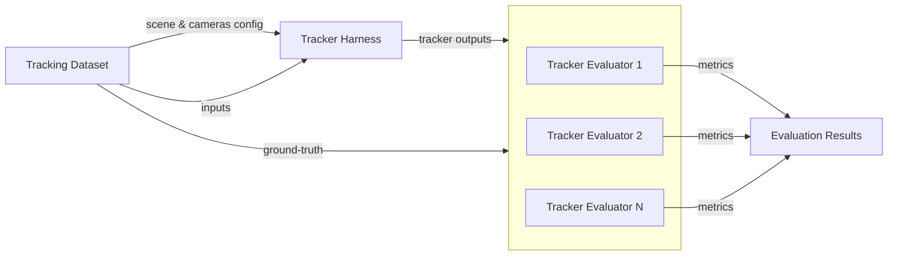

# Design Document: Tracker Evaluation Pipeline

- **Author(s)**: [Tomasz Dorau](https://github.com/tdorauintc)
- **Date**: 2026-02-21
- **Version**: 0.1
- **Status**: `Accepted`

---

## Overview

The goal of this document is to explain how the [tracking evaluation strategy](../adr/0009-tracking-evaluation.md) is going to be realized.

## Design goals

- Enable user to evaluate different tracker implementations using state-of-the-art industry-standard datasets and evaluation toolkits with minimal effort.
- Enable easy automation of evaluation and consuming metrics, including feedback loops for model training in future
- Enable quick adoption of new datasets
- Enable performance optimizations for huge datasets
- Extensibility
- Experiment reproducibility

## List of base component classes:

1. Tracking Dataset - data that consists of:
   - static scene and cameras configuration
   - inputs: videos and / or sequences of object detections from multiple cameras
   - ground-truth: sequences of each object location
   - optionally additional context data and metadata
2. Tracker Harness - executes a process that:
   - consumes:
     - scene and camera configuration from dataset in canonical format
     - input videos or object detections from dataset in canonical format
     - specific configuration dependent on tracker type (e.g. tracker configuration, models used in video pipelines)
   - produces:
     - tracker outputs (tracks) in canonical format
3. Tracker Evaluator (e.g. wrapped TrackEval) - executes a process that:
   - consumes:
     - tracker output from Tracker Harness
     - ground-truth from Tracking Dataset
   - produces:
     - metrics & plots evaluating tracker performance

## Extensibility and flexibility requirements (Plug-in architecture):

1. Extensibility (support for specific datasets, trackers etc.) is accomplished by implementing Components' Base Class interfaces in Python language
2. Composability: components in the pipeline can be plugged-in and used together by exposing well-defined interfaces that enable to integrate them in the pipeline
3. Encapsulation and decoupling:
   - Components are decoupled. Each component owns and encapsulates the logic and data needed to accomplish its task, e.g. harness may internally use docker compose and broker to run the tracker, dataset may use HuggingFace Dataset library, but these are implementation details hidden from the pipeline user
   - Data is exchanged in canonical formats
   - Conversions that must be supported by the component implementations:
     - dataset scene and camera configuration to canonical format - part of Tracking Dataset implementation
     - dataset object detection inputs to canonical format - part of Tracking Dataset implementation
     - dataset ground-truth to Tracker Evaluator input track format - part of Tracking Dataset implementation
     - track canonical format to Tracker Evaluator input track format - part of Tracker Evaluator implementation

## Evaluation pipeline:

## Standard data formats:

The pipeline uses standardized data formats for component interoperability. Detailed specifications with examples are documented in [tools/tracker/evaluation/README.md - Canonical Data Formats](../../tools/tracker/evaluation/README.md#canonical-data-formats).

**Format overview**:

- Scene and camera configuration canonical format
- Input object detection canonical format
- Output track canonical format
- Tracker Evaluator input track format

### Format Conversion Utilities

Dataset implementations use format conversion utilities to transform data between canonical JSON formats and evaluator input formats. The utilities provide:

- **JSON→JSON conversion**: Pointer-based mapping (RFC 6901) for schema transformations with **strict validation** (all fields must exist)
- **JSON→CSV conversion**: Column mapping with **lenient validation** (missing fields become null/NaN)
- **CSV→DataFrame reading**: Dask-based CSV parsing for efficiency

**Libraries used**:

- `python-rapidjson`: Fast JSON serialization/deserialization
- `jsonpointer`: RFC 6901 JSON pointer support for nested field access
- `dask`: Efficient CSV reading and writing, especially for large datasets

**Validation behavior**:

- Schema transformations (JSON→JSON): Strict - raises exception on missing fields
- Data export (JSON→CSV): Lenient - sets missing fields to null to handle incomplete tracker outputs

## Modes of operation:

Default mode (the only one supported):

- Offline (Batch) - default: whole data sequence is processed at once by each component and stored as a complete list in memory or filesystem

Notes: A specific harness / dataset implementation may support only a subset of models

## Pipeline configurability:

1. Declarative: user declares desired pipeline state: components implementation, mode of operation, configuration for each component in YAML file
2. User declares specific implementation to be used as a path to Python class implementing base component interface, which is a single entry-point for using it
3. Mode of operation
4. Dataset configuration
   - Choice of scene
   - Choice of cameras for the scene
   - Choice of time range for the input sequences
5. Harness configuration
   - Tracker specific configuration, e.g. tracker container image and tag
6. Evaluators
   - List of evaluators to run
   - Set of metrics per evaluator

## Minimal Interfaces of Component Classes (as of Phase 1)

### Tracking Dataset

Base class: `base.tracking_dataset.TrackingDataset`

Implementation of the component class must implement the following abstract methods:

- **set_scene**(scene: Optional[str] = None) -> TrackingDataset
  - Set the scene to use from the dataset
  - Args: scene identifier (optional, uses default/first scene if None)
  - Returns: self for method chaining
  - Raises: ValueError if scene invalid, RuntimeError on other errors

- **set_cameras**(cameras: Optional[List[str]] = None) -> TrackingDataset
  - Set the cameras to use from the scene
  - Args: list of camera identifiers (optional, uses all available if None)
  - Returns: self for method chaining
  - Raises: ValueError if cameras invalid, RuntimeError on other errors

- **set_time_range**(start: Optional[str] = None, end: Optional[str] = None) -> TrackingDataset
  - Set the time range for input sequences
  - Args: start/end timestamps (optional, format depends on implementation)
  - Returns: self for method chaining
  - Raises: ValueError if invalid or start > end, RuntimeError on other errors

- **set_camera_fps**(camera_fps: float) -> TrackingDataset
  - Set the camera frame rate for input sequences
  - Args: camera frames per second
  - Returns: self for method chaining
  - Raises: ValueError if invalid or not supported, RuntimeError on other errors

- **set_custom_config**(config: Dict[str, Any]) -> TrackingDataset
  - Set custom dataset-specific configuration
  - Args: custom configuration dictionary (format depends on implementation)
  - Returns: self for method chaining
  - Raises: ValueError if invalid, RuntimeError on other errors

- **set_output_folder**(path: Path) -> TrackingDataset
  - Set folder where dataset-specific outputs or cached artifacts should be stored
  - Args: path to output folder (created if it does not exist)
  - Returns: self for method chaining
  - Raises: ValueError if path invalid, RuntimeError on other errors

- **get_scene_config**() -> Dict[str, Any]
  - Get scene and camera configuration in dataset-specific format
  - Returns: scene configuration dictionary (dataset-specific format)
  - Raises: RuntimeError if cannot be loaded
  - Note: TODO - will return canonical format when schemas stabilize

- **get_inputs**(camera: Optional[str] = None) -> Iterator[Dict[str, Any]]
  - Get input detections in canonical format, sorted by timestamp
  - Args: camera identifier (optional, returns all cameras if None)
  - Yields: detection dictionaries in canonical Input Detection Format, chronologically sorted
  - Raises: ValueError if camera invalid, RuntimeError on other errors

- **get_ground_truth**() -> str
  - Get ground-truth data in evaluator input format
  - Returns: path to ground-truth file in Ground Truth Format (MOTChallenge 3D CSV)
  - Raises: RuntimeError if cannot be loaded or converted

- **reset**() -> TrackingDataset
  - Reset dataset state to initial configuration
  - Returns: self for method chaining

Future extensions of the interface will be driven by the need of adopting specific datasets and tracking algorithms, e.g. the interface could support division into training and validation sets.

### Tracker Harness

Base class: `base.tracker_harness.TrackerHarness`

Implementation of the component class must implement the following abstract methods:

- **set_scene_config**(config: Dict[str, Any]) -> TrackerHarness
  - Set scene and camera configuration
  - Args: scene configuration in canonical Scene Configuration Format
  - Returns: self for method chaining
  - Raises: ValueError if invalid, RuntimeError on other errors
  - Note: Currently accepts dataset-specific format until schemas stabilize

- **set_custom_config**(config: Dict[str, Any]) -> TrackerHarness
  - Set tracker-specific configuration
  - Args: custom configuration dictionary (format depends on implementation)
  - Returns: self for method chaining
  - Raises: ValueError if invalid, RuntimeError on other errors

- **set_output_folder**(path: Path) -> TrackerHarness
  - Set folder where harness-generated outputs or logs should be stored
  - Args: path to output folder (created if it does not exist)
  - Returns: self for method chaining
  - Raises: ValueError if path invalid, RuntimeError on other errors

- **process_inputs**(inputs: Iterator[Dict[str, Any]]) -> Iterator[Dict[str, Any]]
  - Process input detections through the tracker synchronously (default mode)
  - Args: iterator of detection dictionaries in canonical Input Detection Format
  - Returns: iterator of tracker outputs in canonical Tracker Output Format
  - Raises: RuntimeError if processing fails
  - Use for: batch processing, testing, simple evaluation pipelines

- **reset**() -> TrackerHarness
  - Reset harness state to initial configuration
  - Returns: self for method chaining

Future extensions of the interface will be driven by the need of evaluating specific implementations, e.g. black-box tests of production service vs experimental tracker implementation.

### Tracker Evaluator

Base class: `base.tracker_evaluator.TrackerEvaluator`

Implementation of the component class must implement the following abstract methods:

- **configure_metrics**(metrics: List[str]) -> TrackerEvaluator
  - Configure which metrics to evaluate
  - Args: list of metric names to compute (e.g., ['HOTA', 'MOTA', 'IDF1'])
  - Returns: self for method chaining
  - Raises: ValueError if metric not supported, RuntimeError on other errors

- **set_output_folder**(path: Path) -> TrackerEvaluator
  - Set folder where evaluation results should be stored
  - Args: path to results folder (will be created if does not exist)
  - Returns: self for method chaining
  - Raises: ValueError if path invalid, RuntimeError on other errors

- **process_tracker_outputs**(tracker_outputs: Iterator[Dict[str, Any]], ground_truth: Iterator[Dict[str, Any]]) -> TrackerEvaluator
  - Process tracker outputs and ground-truth for evaluation
  - Args:
    - tracker_outputs: iterator of tracker output dictionaries in canonical Tracker Output Format
    - ground_truth: iterator of ground-truth tracks in evaluator-specific format
  - Returns: self for method chaining
  - Raises: RuntimeError if processing fails

- **evaluate_metrics**() -> Dict[str, float]
  - Evaluate configured metrics
  - Returns: dictionary mapping metric names to computed values
  - Raises: RuntimeError if evaluation fails or no data processed

- **reset**() -> TrackerEvaluator
  - Reset evaluator state to initial configuration
  - Returns: self for method chaining

## Tracker Evaluation Pipeline Engine Module

The highest level component in the design is the Pipeline Engine module, which implements PipelineEngine class.

The module should also contain short main() function that will run if the module is executed as a Python script.
The only argument for the script should be the path to configuration file.

PipelineEngine class exposes the following methods:

### Load Configuration

The only argument for the function should be the path to configuration file.

What it does:

1. Loads and parses a single YAML configuration file
2. Imports Dataset, Harness and Evaluator modules from paths provided in the configuration file.
3. Creates instances of the imported Component Classes.
4. Configures each of the instances with the component parameters provided in the configuration file.
5. Performs capability discovery for each of the component instances, if necessary for proper pipeline configuration.

Raises exception on error.

### Run

Runs the tracker on the dataset.
No input arguments.
Raises exception on error.

### Evaluate

Evaluates metrics based on the dataset ground-truth.
No input arguments.
Raises exception on error.
Returns: dict { <metric name>: <metric value> }

## TrackEval Library Adoption

The pipeline adopts [TrackEval](https://github.com/JonathonLuiten/TrackEval) as the primary evaluation toolkit for Phase 1. TrackEval is the reference implementation for HOTA (Higher Order Tracking Accuracy) and supports a comprehensive suite of tracking metrics including DetA, AssA, LocA, IDF1, MOTA, and MOTP.

TrackEval does not provide native support for 3D ground-truth evaluation. To address this limitation, the implementation includes a custom dataset adapter (`MotChallenge3DPoint`) that extends TrackEval's base dataset class to handle 3D point tracking. This adapter uses Euclidean distance for similarity computation in world coordinates and formats ground-truth and tracker outputs to conform to TrackEval's expected data structures.

The integration maps canonical pipeline formats (JSON-based detection and track outputs) to TrackEval's MOTChallenge-style CSV format through format conversion utilities, enabling seamless evaluation of SceneScape's 3D tracking outputs against industry-standard metrics.

## Open Questions

### What mechanisms to use for experiment reproducibility?

By experiment reproducibility we mean that based on the experiment outputs:

1. We are able to verify whether two experiments were executed with the same or different configuration.
2. We are able to verify whether two experiments were executed with the same or different environment.
3. We are able to identify any significant difference between two experiments in configuration or environment.
4. We are able to reproduce a given experiment reliably.

Methods to be considered (not exhaustive list):

- add methods returning configuration signature to component base interfaces (configuration signature could be a map of `{<resource>:<unique ID>}` that allows to compare component configurations in two experiments, e.g. input file checksum, container image checksum)
- dump configuration along with its signature map for each component in the pipeline
- dump configuration of the pipeline
- dump repository commit SHA
- dump dependencies versions / checksums
- dump HW information
- dump system information: CPU and memory load, machine ID, kernel, Python version etc.
