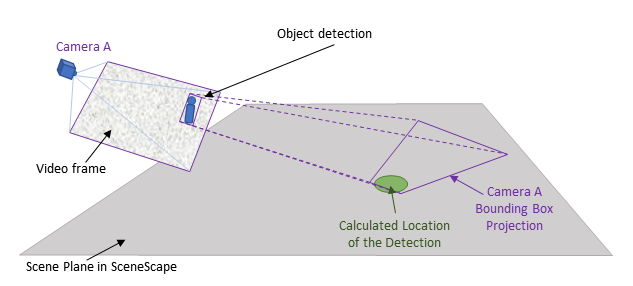
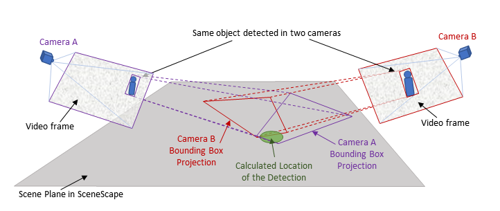
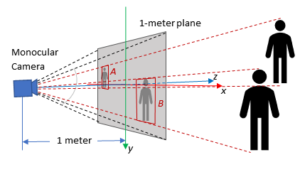

# How Intel® SceneScape converts Pixel-Based Bounding Boxes to Normalized Image Space

This document provides details on how Intel® SceneScape converts object detection bounding boxes from pixel coordinates to normalized image space.

## From Pixels to Scene

Before getting into the details, it is helpful to understand how Intel® SceneScape maps detections from image frames onto the scene. Basically, we need to figure out where a given light ray came from in the world, through the lens, and to the sensor.

Pixel-based bounding boxes alone are insufficient to determine where the associated objects or people are in a common scene, so Intel® SceneScape works to bring in additional information about the camera -- things like its focal length and position in the scene. We are essentially reprojecting pixels back onto the world scene using the [geometry of camera image formation](https://learnopencv.com/geometry-of-image-formation/).

The characteristics of the camera that are independent of its position, like resolution and focal length, are called "camera intrinsics." The position and orientation of the camera in the scene are called "camera extrinsics." We need both intrinsics and extrinsics, but Intel® SceneScape already provides tools to determine the extrinsics: a manual camera calibration interface for fixed cameras and forthcoming methods like SLAM (simultaneous localization and mapping) for automating the process for both fixed and moving cameras.

That leaves the intrinsics. Every camera is a bit different, so Intel® SceneScape expects the data from cameras to be provided in a special way that is completely independent of the resolution or zoom level or other camera nuances. We call this "camera agnostic metadata" for object detections, and there are straightforward ways to generate this metadata given things you probably already know about the camera (or can quickly figure out).

We'll walk through some motivations for the method, how bounding boxes are projected to the scene, creating estimated intrinsics from common camera values, and then creating the normalized bounding boxes.

### Projecting a Bounding Box onto the Scene

Once all the pieces are in place, Intel® SceneScape can essentially "project" detected objects onto the scene and apply its tracking system to update the associated nodes in the scene graph.

Intel® SceneScape's tracking system does not directly ingest images or video. Instead, it consumes the output of a video analytics pipeline. This has several key advantages:

1. **Privacy**: Only the bounding box and other detection metadata are sent to Intel® SceneScape, not the actual images (except for camera calibration and preview purposes)
2. **Latency and Bandwidth**: If only the metadata are being transmitted, less bandwidth and less time are needed to transmit than the full video
3. **Various Detection Technologies**: Many models and methods exist for object/person detection using images, video, and other image-like data (e.g. thermal, radar, infrared), and Intel® SceneScape should be able to utilize these systems and modalities

### Projecting a Single Bounding Box

Let us start with a single camera. Figure 1 illustrates a camera detection in a video frame, and shows how the bounding box can be projected to the scene.



**Figure 1:** Projecting a bounding box onto the scene from Camera A

The location of the object in the scene can now be estimated. For a flat scene with no occlusions the scene location is usually in the neighborhood of the part of the bounding box closest to the camera (the bottom center point of the bounding box).

**Note**: Only the green dot representing the detection location is shown since Intel® SceneScape does not have access to the source image.

### Projecting Bounding Boxes from Multiple Cameras

When multiple cameras see the same object or person, then the projected bounding boxes may overlap in the scene as shown in Figure 2.



**Figure 2:** Projecting multiple bounding boxes onto a common scene

Intel® SceneScape utilizes these detections from various viewpoints to update the associated node in the scene graph. Note that the detections from various sources arrive asynchronously, so source timestamps and time coordination are critical to effective tracking.

### Normalized, Camera Agnostic Metadata

Detection metadata is usually provided in pixel units. Here is an example of a detected object in a frame:

```
{
   "objects":[
      {
         "type":"person",
         "bounding_box":{
            "top":157,
            "left":221,
            "width":108,
            "height":259
         }
      }
   ]
}
```

Without knowing the resolution or field of view of the camera, there is no way to project this bounding box onto the scene. What if we could use the same schema but just publish the bounding boxes in a way that is completely camera-independent? It turns out we can do just that. With a bit of math, we can now apply the intrinsics to this pixel-based data in a way that will not change if the camera is zoomed in or out or the resolution changes.

The output will look something like this, where the values are now floating point numbers instead of integers:

```
{
   "objects":[
      {
         "type":"person",
         "bounding_box":{
            "x":-0.21945553,
            "y":-0.27470306,
            "width":0.16574262,
            "height":0.3974754
         }
      }
   ]
}
```

We calculate these values by projecting the bounding boxes onto an imagined plane that sits one unit length in front of the camera.

**Note**: For simplicity we call it the "1-meter plane", but the numbers are normalized so any unit can be used. However, it is best to stick to meters for consistency with SI units. In general, this type of representation is called "normalized image space."

Figure 3 illustrates two bounding boxes projected onto the 1-meter plane.



**Figure 3:** Projecting detections on the 1-meter plane

Observe that in normalized image space:

- If the camera is zoomed in or out, the "area" of the 1-meter plane changes but the position of the bounding boxes remains fixed
- If the resolution changes the area of the 1-meter plane remains the same and the bounding boxes also stay fixed within the resolution limit of the image
- In order to preserve a right-handed coordinate system with $z$ pointing away from the camera, the $y$ axis is pointing down.

## Prerequisites

Before You Begin, ensure the following:

- **Dependencies Installed**:
  - Python 3
  - OpenCV (`cv2`)
  - NumPy
- **Input Data**: Object detection bounding boxes in pixel format and known camera resolution and diagonal FOV.

## Steps to Convert Bounding Boxes

### Step 1: Define Camera Parameters

You need to specify the resolution and diagonal FOV of the camera. Example:

```python
resolution = [800, 600]  # horizontal, vertical
fov = math.radians(75)   # diagonal FOV in radians
```

### Step 2: Estimate Camera Intrinsics

Use the angle-of-view formula to compute the focal length and construct the intrinsics matrix:

```python
cx = resolution[0] / 2
cy = resolution[1] / 2
d = math.sqrt(cx * cx + cy * cy)

fx = fy = d / math.tan(fov / 2)

intrinsics = np.array([[fx, 0.0, cx], [0.0, fy, cy], [0.0, 0.0, 1.0]])
```

### Step 3: Normalize Bounding Box Coordinates

Given a bounding box in pixel format:

```python
bb = {'top':157,'left':221,'width':108,'height':259}
```

Use OpenCV to project to the normalized image plane:

```python
distortion = np.zeros(4)

p = np.array(
   [
      [bb['left'], bb['top']],
      [bb['left'] + bb['width'], bb['top'] + bb['height']]
   ], dtype=np.float32)

p_norm = cv2.undistortPoints(p, intrinsics, distortion)

bb['left'] = p_norm[0][0][0]
bb['top'] = p_norm[0][0][1]
bb['width'] = p_norm[1][0][0] - p_norm[0][0][0]
bb['height'] = p_norm[1][0][1] - p_norm[0][0][1]
```

### Step 4: Verify the Results

```python
print(bb)
```

**Expected Results**:

```
{'top': -0.21945553, 'left': -0.27470306, 'width': 0.16574262, 'height': 0.3974754}
```

> **Note:** Intel® SceneScape also provides some helper classes and methods for transforming data from pixel space to normalized image space. Intel® SceneScape includes [scene_common/transform.py](https://github.com/open-edge-platform/scenescape/blob/release-2025.2/scene_common/src/scene_common/transform.py) to provide various methods for handling these transformations.

## Configuration Options

### Customizable Parameters

| Parameter    | Purpose                               | Expected Values                                  |
| ------------ | ------------------------------------- | ------------------------------------------------ |
| `resolution` | Camera resolution in pixels           | e.g. `[800, 600]`                                |
| `fov`        | Diagonal field of view in radians     | e.g. `math.radians(75)`                          |
| `bb`         | Original bounding box in pixel format | Dictionary with `top`, `left`, `width`, `height` |

## Supporting Resources

- [Intel® SceneScape README](https://github.com/open-edge-platform/scenescape/blob/release-2025.2/README.md)
- [Geometry of Camera Image Formation](https://learnopencv.com/geometry-of-image-formation/)
