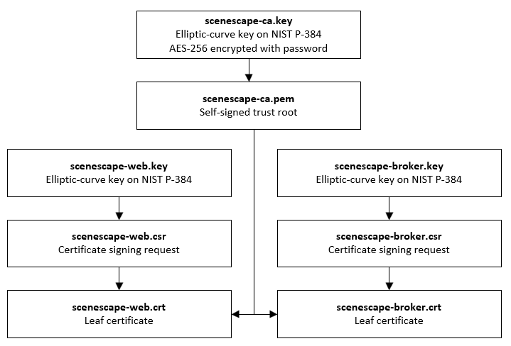

# Intel® SceneScape Hardening Guide

## 1: Introduction

### Scope

This guide outlines the important security considerations for deploying, configuring, and operating Intel® SceneScape, and describes some of the steps that system integrators can take to optimize the security posture of their Intel® SceneScape installation.

Chapter 2 describes the primary network trust boundary around Intel® SceneScape, including a list of the network ports opened by Intel® SceneScape and the purpose of each port.

Chapter 3 describes the secrets and security assets created by Intel® SceneScape, including account passwords, keys, and TLS certificates, and some considerations for protecting those assets.

Chapter 4 describes the MQTT broker authentication and authorization flow in more detail, describing the centralized authentication system as well as the ACL functionality to restrict topic access to specific users.

Chapter 5 includes some notes for configuring the Apache modules bundled with Intel® SceneScape.

Chapters 6 and 7 list general suggestions and vetted external resources for hardening the Docker container runtime and Linux host system respectively. One of the main security design objectives of Intel® SceneScape is that its underlying software components come securely configured out of the box. Furthermore, Intel® SceneScape itself is designed to require minimal configuration during and after deployment. As such, the most important part of securing an Intel® SceneScape installation is actually securing the computer platforms atop which Intel® SceneScape is deployed.

Chapter 8 covers best practices for securing third-party API keys when integrating external services into Intel® SceneScape. It provides guidance on restricting API key permissions, rotating keys regularly, and monitoring usage to minimize the risk of exposure in the web client.

Chapter 9 discusses security features and improvements planned for upcoming releases of Intel® SceneScape.

### Audience

The intended audience for this document is system integrators and engineers who are responsible for defining, implementing, and validating an Intel® SceneScape installation.

## 2: Secure Networking Configuration

### Network trust boundary

The services comprising an Intel® SceneScape deployment communicate with one another over the network. By design, the container network used for internal communication is a trusted network, considered to be inside a trust boundary.

This means that, while most internal communication is still TLS-encrypted, internal services like the PostgreSQL database and the NTP server should not be exposed to clients outside the container network. The default Docker Compose deployment configuration does not expose these services to the outside, and the deployment configuration should not be modified to expose them.

The only Intel® SceneScape ports which should be exposed outside the boundary of the container network are enumerated in the following section.

### Ports used by Intel® SceneScape

The following table summarizes the network ports exposed by Intel® SceneScape’s services.

| Port | Service   | Purpose                                                                                 |
| ---- | --------- | --------------------------------------------------------------------------------------- |
| 443  | Apache    | HTTP server providing web interface, REST API, and websocket access to MQTT broker      |
| 1883 | Mosquitto | Main broker port, providing MQTT message bus access via a TLS-encrypted TCP connection. |

## 3: Secret creation and management

### Intel® SceneScape TLS overview

Intel® SceneScape uses TLS for server authentication and to encrypt communication between services.

For demonstration and testing purposes, the out-of-box `deploy.sh` script creates a self-signed root certificate authority (CA) and uses that CA to issue certificates for the web server and the MQTT broker. In a production situation, certificates should be signed by a CA trusted by the systems running Intel® SceneScape.

**Intel does not provide certificates.** The self-signed certificates produced by the out-of-box `deploy.sh` script are not intended for production use. Certificate and key management are the responsibility of the customer.

The following sections detail the certificate generation process, including some technical information about the TLS keys and certificates produced by Intel® SceneScape deployment scripts.

### Generating self-signed trust chain

The following `make` command is used by the `deploy.sh` script to generate the self-signed trust chain for Intel® SceneScape:

```
make -C ./tools/certificates CERTPASS="${CERTPASS}"
```

where `CERTPASS` is set beforehand to a long random string generated with `openssl rand -base64 33`. This means that, in future, the same CA cannot be used to generate more certificates. The random string is not known to anyone, including the user performing the deployment.

If you need to know the `CERTPASS` in order to generate more certificates in future, you can remove the `manager/secrets/ca` and `manager/secrets/certs` directories and run the `make` command again, specifying your own custom `CERTPASS` variable. In a default deployment, this is not needed.

### Configuring the certificate generation tooling

The following `make` variables can be used with the certificate tooling, via `make -C ./tools/certificates VARIABLE1=foo VARIABLE2=bar`.
Variable|Purpose
--------|-------
SECRETSDIR|Location to place generated TLS assets. Defaults to `../../manager/secrets`.
HOST|Hostname for generated certificate. Used alongside `CERTDOMAIN` to set certificate CN and DNS X509v3 SAN.
CERTDOMAIN|Domain name suffix for generated certificate. Used alongside `HOST` to set certificate CN and DNS X509v3 SAN. Defaults to `scenescape.intel.com`.
IP_SAN|An IP address to use as the IP Address X509v3 subject alternative name. If set, the certificate or CSR will include the `IP Address` SAN configured to this value.
CERTPASS|CA key password. Used to protect and later unlock the self-signed trust root.

### Generating CSRs for later signing

By default, the built-in certificate generation tooling produces a trust chain composed of a self-signed root CA which issues certificates for each service. However, if your organization uses its own trust root, the certificate generation tooling can also produce CSRs that can be signed by your CA.

To generate CSRs, run the following command from the root Intel® SceneScape directory:

```
make -C ./tools/certificates deploy-csr
```

A CSR will be generated for each service and placed in the secrets directory, which defaults to `manager/secrets/` in the Intel® SceneScape repository but can be set with the SECRETSDIR variable.

Note that the parameters of these certificates are specified in `certificates/Makefile` and `certificates/openssl.cnf`. The following section gives an overview of the parameters used. Your CA may have different requirements for certificate parameters, which can be accomplished by modifying the relevant configuration or generation commands.

### Certificate and CSR parameters

- Keys used are elliptic-curve keys over the NIST P-384 curve (`secp384r1`).
- Signature algorithm is ECDSA with SHA384 (`ecdsa-with-SHA384`).
- Self-signed root CA lifetime is 1825 days (5 years).
- Service certificates are issued with a lifetime of 360 days (1 year).
- Service certificates are issued with a DNS X509v3 Subject Alternative Name matching the CN of the certificate, and additionally with an IP Address X509v3 SAN if specified.



### Intel® SceneScape Passwords

Upon first executing the `deploy.sh` script, the user will be informed about the superuser (SUPASS) password generated. This password is used by the web server for authentication. When accessing the web interface, the default superuser login is "admin" and then the SUPASS entered at deployment is used as the password. This password can be changed using the Admin panel once logged in to the system, and additional users can be added.

The deploy script will also create additional passwords, keys, and certificates. All will be stored under the path `manager/secrets`, which is created during the building step. These secrets are unique to the current Intel® SceneScape instance.

It is the system integrator’s responsibility to manage access to the file system and the data in the `manager/secrets` folder.

Note that if multiple systems or virtual machines need to connect a given Intel® SceneScape instance, those systems must also utilize the same authentication mechanisms and credentials. The `manager/secrets` folder or the appropriate data (such as MQTT credentials) must be available on the container or system that is connecting to Intel® SceneScape.

#### Django

| Name              | Description                                        |
| ----------------- | -------------------------------------------------- |
| SECRET_KEY        | Django-specific key to protect the Django instance |
| DATABASE_PASSWORD | Password for the SQL database user used by Django  |

The Django passwords are generated during execution of the `build-all` and `build-secrets` make targets or when running `deploy.sh`. The specific code resides in `manager/Makefile` file.

For `SECRET_KEY` the following short Python script is used:

```
python3 -c 'import secrets; print("\x27"+ "".join([secrets.choice( "abcdefghijklmnopqrstuvwxyz0123456789!@#$%^&*(-_=+)") for i in range(50)]) + "\x27")'
```

`SECRET_KEY` is a Django-specific setting. As described in the Django documentation, this value should be unique per installation and should be kept secret. More information about the `SECRET_KEY` can be found here: https://docs.djangoproject.com/en/4.0/ref/settings/#secret-key

For `DATABASE_PASSWORD`, OpenSSL is used to generate a random 12-byte value, base64 encoded:

```
openssl rand -base64 12
```

Alternatively, the `DATABASE_PASSWORD` can be set by the customer by setting a `DBPASS` environment variable before executing the deploy.sh script.

#### MQTT broker service accounts

The Intel® SceneScape Mosquitto MQTT broker requires clients to authenticate with their username and password before connecting. Intel® SceneScape components which need to access the broker internally are provisioned service accounts at deploy time.

The JSON credential files `*.auth` are generated during execution of the `build-all` and `build-secrets` make targets or when running `deploy.sh`. The code to generate them resides in the top level `Makefile`. At runtime, the `scenescape-init` script reads these files and creates users matching these credentials in the Django accounts system. Broker authentication then happens against the Django database via the web API.

The table below shows which files are created, the usernames of the service accounts contained in the files, and the purpose of the account.

| Name             | User        | Purpose                    |
| ---------------- | ----------- | -------------------------- |
| controller.auth  | scenectrl   | Scene controller           |
| browser.auth     | webuser     | Web UI client-side access  |
| calibration.auth | calibration | Camera calibration service |

For more information about security of the Mosquitto broker in Intel® SceneScape, including information about the ACL functionality, see the next chapter. For Mosquitto documentation, see: https://mosquitto.org/documentation/.

## 4: Mosquitto authentication, authorization, and ACLs

To authenticate to the broker and establish a connection, users must supply their username and password. Internally, the Mosquitto authentication plugin will call the Intel® SceneScape REST API endpoint `api/v1/auth`, which queries the database and allows broker access if the credentials are correct.

The Intel® SceneScape broker also uses the Mosquitto Access Control List (ACL) functionality, for fine-grained topic-level permissions. For each topic, each user account has one of four varying access levels, as described in the table below.

| Level | Description                                        |
| ----- | -------------------------------------------------- |
| 0     | Cannot subscribe or publish, no access. Default.   |
| 1     | Can subscribe, but not publish. Read-only access.  |
| 2     | Can publish, but not subscribe. Write-only access. |
| 3     | Can subscribe and publish. Full read-write access. |

When an account attempts to access a topic, the broker will call the `api/v1/aclcheck` API endpoint internally, which will check that user's ACL configuration in the database before granting or denying access to the topic.

The system service accounts as described in the prior section have a default set of ACLs defined in `docker/user_config.json`. Accounts which are Django superusers, such as the `admin` account created by default during deployment, have full read-write access to all topics. Otherwise, freshly created accounts have no access to the broker for any topic. To grant topic access to a specific account, make changes in the web UI admin panel.

## 5: Apache configuration

### mod_reqtimeout configuration

Intel® SceneScape's Apache web server comes preinstalled with the `mod_reqtimeout` plugin, which performs simple DoS attack mitigation, including prevention of the slow loris attack type and other DoS attacks which seek to tie up connection resources on the web server. `mod_reqtimeout` has some tunable parameters which may need to be modified for your environment.

_Note:_ While Apache `mod_reqtimeout` provides a basic level of robustness, if your Intel® SceneScape installation will be exposed to the open internet, you'll likely need additional protection such as a web application firewall (WAF) or dynamic load balancer (DLB) in front of the web interface.

The `mod_reqtimeout` tunables can be changed via the `RequestReadTimeout` directive in `apache2.conf`. The directive syntax is as follows:

```
RequestReadTimeout [handshake=timeout[-maxtimeout][,MinRate=rate] [header=timeout[-maxtimeout][,MinRate=rate] [body=timeout[-maxtimeout][,MinRate=rate]
```

- `timeout` (seconds) is the amount of time a connection will remain open while a request completes. At the end of the timeout period, the connection will be closed.
- `MinRate` (bytes per second) is an optional parameter which allows the connection to remain open past the timeout period as long as data as being received at the given rate.
- `maxtimeout` (seconds) is an optional parameter which puts an upper bound on the `MinRate` extension. In other words, the connection will still be closed after `maxtimeout` expires even if data is still being transfered at `MaxRate`.

The default values for the directive are as follows:

```
RequestReadTimeout handshake=0 header=20-40,MinRate=500 body=20,MinRate=500
```

For more information, see the [Apache documentation](https://httpd.apache.org/docs/2.4/mod/mod_reqtimeout.html) on `mod_reqtimeout`.

## 6: Docker runtime hardening

### CIS Docker Benchmark

The Center for Internet Security (CIS) publishes a series of guides called the CIS Benchmarks. The CIS Benchmarks are secure configuration guides for popular software products and platforms.

The CIS Benchmark for Docker is a set of recommendations which can be applied to a Docker installation in order to improve its security posture.

### Docker Bench for Security

Docker, Inc. publishes an automated security benchmark, called Docker Bench for Security, which is based on the CIS Benchmark for Docker.

https://github.com/docker/docker-bench-security

To run the tests and produce a report which can be used to assess compliance against the CIS Benchmark for Docker, use the following commands on the container host:

```
git clone https://github.com/docker/docker-bench-security.git
cd docker-bench-security
sudo sh docker-bench-security.sh
```

Each item in the report corresponds to a specific recommendation in the CIS Benchmark. Note that some items cannot be tested automatically, but require manual checking.

**_Note:_** there is a version of Docker Bench for Security available as a container image on Docker Hub, but it is no longer updated by Docker, Inc. and is **4+ years out of date.** Do **_NOT_** use the version of the benchmark on Docker Hub. Always run the benchmark from the GitHub repository as shown above, or use the alternative instructions in the repository documentation to build and run your own Docker image variant of the benchmark.

## 7: Host system hardening

### CIS Benchmarks for Linux systems

Just as the CIS publishes a Benchmark guide for Docker installations, it also publishes Benchmarks for the most commonly used Linux distributions. The recommendations in CIS Benchmarks for Linux systems can be applied to the operating system and its services to improve its security posture.

#### Distributions with a CIS Benchmark

The following is a list of some of the common Linux distributions which have a CIS Benchmark guide available:

- AlmaLinux
- Amazon Linux
- CentOS
- Debian
- Fedora
- RHEL
- Rocky Linux
- SUSE
- Ubuntu

#### CIS Benchmark Profiles

CIS Benchmarks usually include a Level 1 and Level 2 Profile.

- Level 1 is a baseline hardened configuration which is intended to be “practical and prudent” and to provide a clear security benefit without significantly inhibiting the utility of the underlying platform.
- Level 2 is an extension of Level 1, not a standalone profile. Level 2 is intended for environments or use cases where security is paramount, but applying Level 2 recommendations may inhibit the utility or performance of the platform.

In general, we recommend applying recommendations from the Level 1 profile, as Level 2 recommendations may prevent Intel® SceneScape from working as intended.

For benchmarks which contain multiple types of profiles, such as the CIS Ubuntu Linux 22.04 LTS benchmark, we recommend applying the Level 1 Server profile.

#### Automating CIS Benchmark for Linux deployment

The CIS Benchmark guides for Linux distributions are comprehensive and detailed enough that applying the recommendations by hand would be a significant administrative burden.

If your enterprise already uses a configuration management system, talk to your IT administrators about applying the CIS recommendations to systems hosting Intel® SceneScape. Your configuration management system may come with CIS Benchmark configurations, or you may be able to license them from the Center for Internet Security.

If you don’t already have a configuration management system in place, the following options may be of interest to you.

##### OpenSCAP

OpenSCAP, a free and open-source security compliance solution, comes with configuration profiles for CIS benchmarks as part of its SCAP Security Guide profile collection.

https://www.open-scap.org/getting-started/

##### Ubuntu Security Guide

If your enterprise has an Ubuntu Pro subscription, the Ubuntu Security Guide utility that ships with Ubuntu 20.04 and later can be used to automatically apply CIS recommendations to an Ubuntu system.

https://ubuntu.com/security/certifications/docs/usg

## 8: Securing Third-Party API Keys in the Web Client

When integrating third-party services (such as for geospatial mapping) into Intel® SceneScape, API keys may be required and could be exposed in the web client. To minimize risk:

- **Restrict API Key Permissions:** Generate API keys with the least privileges necessary. Limit allowed domains, IPs, or referrers where possible.
- **Rotate Keys Regularly:** Periodically update and replace API keys to reduce exposure from leaked or compromised keys.
- **Monitor Usage:** Use provider dashboards to track API key usage and set up alerts for suspicious activity.

For more information, refer to your third-party provider’s documentation on securing API keys and best practices for web applications.

## 9: Upcoming security features

### Improved auditing and logging

​In a future update, Intel® SceneScape will have improved auditing/logging tools for better deployment observability, SIEM ingestion, etc.
