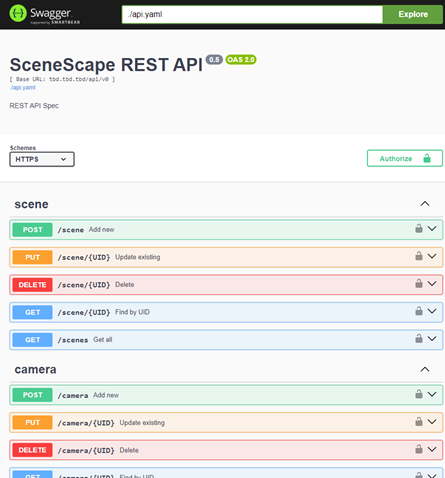

# API Reference

**Version: 1.3.0**

```{eval-rst}
.. swagger-plugin:: ./api-docs/api.yaml
```

# API Specification Viewing Instructions

## 1. Pull Swagger UI image:

```
docker pull swaggerapi/swagger-ui
```

## 2. Run the Swagger UI container

Use a configuration that loads the Intel® SceneScape `docs/user-guide/api-docs/api.yaml` definitions.

General Syntax:

```
docker run -p 80:8080 --user $(id -u):$(id -g) -e SWAGGER_JSON=/mnt/api.yaml -v <full path to parent directory of api.yaml>:/mnt swaggerapi/swagger-ui
```

Re: https://github.com/swagger-api/swagger-ui/blob/master/docs/usage/configuration.md

Example:

```
docker run -p 80:8080 --user $(id -u):$(id -g) -e SWAGGER_JSON=/mnt/api.yaml -v ~/scenescape/docs/user-guide/api-docs:/mnt swaggerapi/swagger-ui
```

Note: Ensure that for the -v option to use the correct path to where Intel® SceneScape repository was cloned (`~/scenescape/` in the example above).

## 3. View API docs via a browser

Navigate to (http://localhost)

**Note:** `https:` is not supported. `localhost` can be replaced with the ip address.

It should look something like this example:



## For additional information on Swagger UI installation to view the API, please see:

- https://github.com/swagger-api/swagger-ui/blob/master/docs/usage/installation.md
