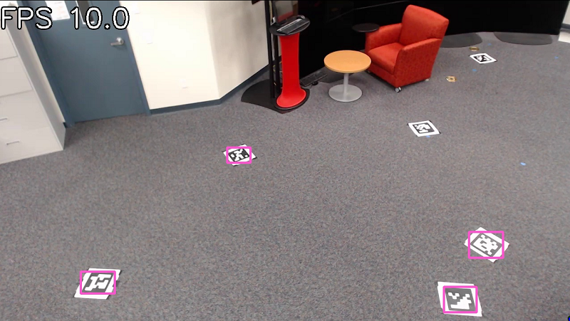
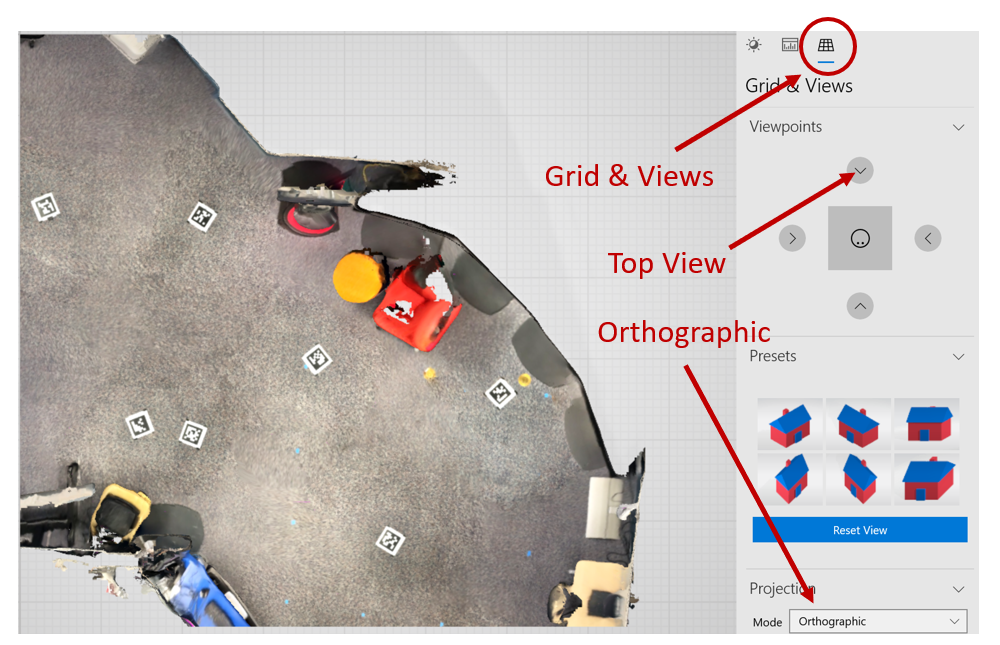
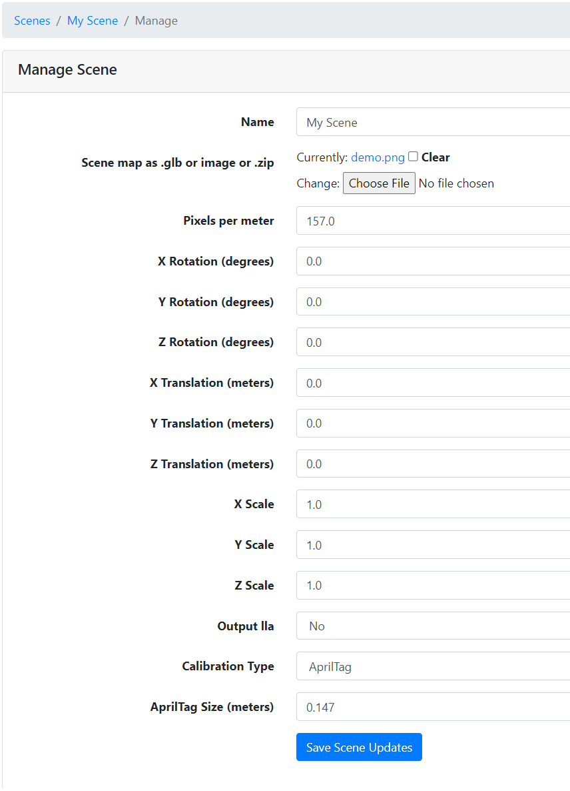
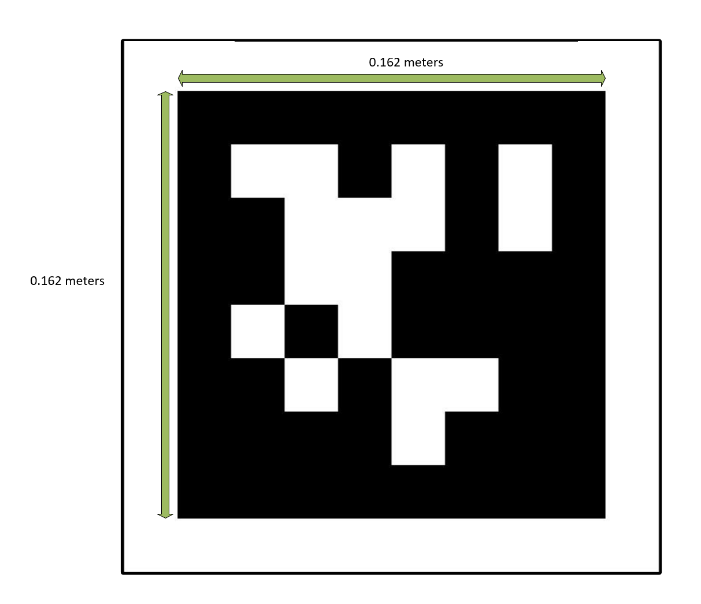
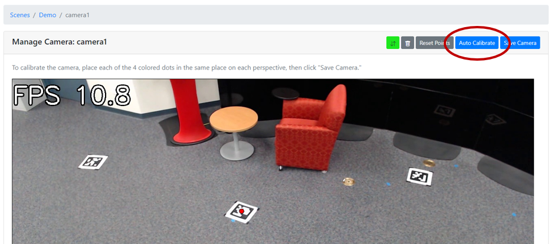

# How to Use AprilTag Camera Calibration in Intel® SceneScape

This guide provides a step-by-step process for calibrating cameras in Intel® SceneScape using fiducial markers (AprilTags). This method ensures accurate tracking by estimating camera poses based on known marker positions.

By following this guide, you will:

- Select and place AprilTags correctly.
- Generate a scene floor plan with markers visible.
- Configure Intel® SceneScape to auto-calibrate using AprilTags.
- (Optionally) Add a 3D map for scene visualization.

This calibration method is ideal for fixed camera setups requiring precise positional accuracy.

---

## Prerequisites

Before You Begin, ensure the following:

- **Camera Setup**: Cameras placed with a clear view of the scene.
- **Scene Created**: Add cameras in Intel® SceneScape and set the detection model to `-m apriltag`.
- **SceneScape Installation**: Installed and running.

> **Note**: To switch from the default person detection model, replace `retail` with `apriltag` in `docker-compose.yml`.

---

## Steps to Calibrate Using AprilTags

### 1. Select and Print AprilTags

- Use this [PDF](../_assets/tag36h11.pdf) to print tags from the `tag36h11` family. Additionally, [AprilTags can be generated](https://github.com/AprilRobotics/apriltag) or downloaded from the [AprilTag-imgs GitHub repository](https://github.com/AprilRobotics/apriltag-imgs).
- Tags must be:
  - Printed the same size.
  - Unique (one ID per scene).
  - Detectable by the camera.
  - Flat, unwrinkled, and glare-free on the floor plane.
  - Large enough to be seen clearly from each camera.

> For best results, print on material that prevents glare and test different sizes.

### 2. Test for Detectability

Place sample tags in the scene and observe the camera feed. Tags should show bounding boxes when detected.



_Figure 1: Testing AprilTag visibility in camera feed._

### 3. Place AprilTags Throughout the Scene

- Distribute tags so each camera sees at least 4.
- Avoid occlusions or placing tags too close together.
- Fix tags in position to avoid movement during calibration.

> **Note**: The same AprilTags can be visible in multiple camera views, but ensure at least 4 tags are detectable in each camera.

---

### 4. Generate Scene Floor Plan

Use a phone/tablet with LiDAR or another method to scan the scene. Export as a `.glb` (glTF binary).

#### Creating a Top-Down Orthographic Floor Plan View

1. Open the `.glb` in Windows 3D Viewer.
2. Switch to orthographic, top-down view.
3. Export the image and determine pixels-per-meter.



_Figure 2: Export top-down orthographic scene view._

> **Notes**
>
> - Ensure AprilTags are clearly visible in the exported image.
> - It may be useful to enable the grid since it helps in determining the pixels per meter for the image (it is a 1-meter grid).

---

### 5. Configure Scene and Calibrate

1. Open Intel® SceneScape and edit the scene.
2. Upload the orthographic image and enter the scale (pixels-per-meter).
3. Set Calibration Type to `Apriltag`.
4. Enter the physical size of the tags.



_Figure 3: Upload scene image and set calibration method._



_Figure 4: Enter AprilTag dimensions._

5. Edit `docker-compose.yml` to enable the `autocalibration` service:

```yaml
autocalibration:
  image: scenescape:<version>
  networks:
    scenescape:
  depends_on:
    - broker
    - ntpserv
    - pgserver
    - scene
  command: autocalibration --dbhost pgserver --ntp ntpserv --broker broker.scenescape.intel.com
  privileged: true
  environment:
    EGL_PLATFORM: "surfaceless"
  volumes:
    - vol-media:/home/scenescape/SceneScape/media
  secrets:
    - certs
    - django
  restart: on-failure
```

6. Restart Intel® SceneScape:

```bash
docker compose down
docker compose up
```

7. Navigate to the camera page and click **Auto Calibrate**.
8. Adjust opacity slider to verify alignment.
9. Click **Save Camera** to finalize pose.



_Figure 5: Auto Calibrate using AprilTags._

### 6. (Optional) Add 3D Map to Scene

1. Edit scene and upload the `.glb` to the **Map 3d** field.
2. Set **X Rotation** to `90.0` to convert Y-up to Z-up.
3. Adjust scale manually.

> **Tips**:
>
> - .glb files are usually in meters.
> - Scale differences between 2D/3D often stem from incorrect pixels-per-meter.

## Customizable Parameters

| Parameter        | Purpose                                            | Expected Values/Range        |
| ---------------- | -------------------------------------------------- | ---------------------------- |
| Calibration Type | Specifies the calibration method                   | `AprilTag`, `Markerless`     |
| Tag Size         | Physical width/height of AprilTags in meters       | Positive float (e.g., 0.15)  |
| Pixels/Per Meter | Scene scale to align 2D image with real-world size | Positive integer (e.g., 100) |
| Camera Model     | Defines the camera projection model                | `Pinhole` (recommended)      |
| Project Frame    | Overlay camera view frustum on 3D scene            | `Enabled`, `Disabled`        |

## Future Enhancements

- Tag placement validation with heatmaps.
- Visual calibration accuracy scoring.
- Easier 3D scan positioning tools.

## Supporting Resources

- [Live Scene Docs](../building-a-scene/how-to-create-new-scene.md)
