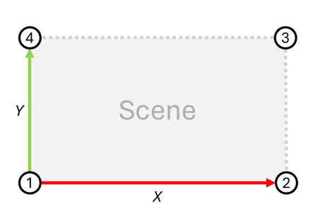

# Configure Geospatial Coordinates for a Scene

With this guide, you will learn how to configure Intel® SceneScape to output geospatial coordinates of detected objects. It involves:

- Setting up reference points of the scene, using local and geospatial coordinate systems.
- Configuring Intel® SceneScape to properly calculate and publish geospatial coordinates (latitude, longitude, altitude).
- Verifying if the coordinates of detected objects are published in MQTT messages.

## Assumptions

To ensure reliability of converting the local coordinates to geospatial ones (accuracy within ~1 meter), certain conditions need to be met. Deviating from these base assumptions may result in inaccurate values of latitude, longitude, and altitude. You can still use the feature without meeting the conditions, in which case, the accuracy of the conversions must be validated experimentally.

- The scene surface is horizontal and relatively flat.
- Both scene surface dimensions (X and Y) are less than 400 meters in length.
- Detected objects are located less than two meters above the scene surface.
- Map corners' geographic coordinates are measured with a negligible measurement error.

## Prerequisites

- **Dependencies Installed**: Intel® SceneScape deployed, MQTT client installed, and MQTT access credentials configured.
- **Access and Permissions**: Appropriate access to edit the scene with the UI and receive MQTT messages on the scene regulated topic.

## Steps to Leverage Built-In Geospatial Map Creation

1. Before launching an Intel® SceneScape instance, ensure the API keys are configured for the selected map provider ([Configure geospatial map service API keys](./configure-geospatial-map-service-api-keys.md)). If the instance is already running, stop the current Web UI container and start a new instance.
1. Click the "New Scene" button at the top right corner of the web homepage.```
1. Switch the "Map Type" to "Geospatial Map".
1. Select the provider for which you have configured the API key.
1. Type the address of interest in the "Location" field and click "Go".
1. Use the controls on the map frame to zoom in or out as needed.
1. Click "Generate Geospatial Bounds & Snapshot" so that:
   - "Output Geospatial Coordinates" field is set to "Yes".
   - "Map Corners" are autopopulated with the geospatial coordinates of the four corners of the map.
   - "Pixels per meter" field is autopopulated with the scale of the scene.
1. Click "Save Scene".
1. For additional details on configuring a scene, follow the [new scene guide](./create-new-scene.md)

## Alternative: Steps to Manually Configure Geospatial Coordinates of the Scene

1. Launch the Intel® SceneScape UI and **Log In**.
1. Create a scene as outlined in the [new scene guide](./create-new-scene.md):

- A scene surface map should be rectangular with edges aligned to the X and Y axes (explicit alignment is required for scenes using 3D models, flat maps loaded from images use it by design). See the next sections for how to verify this condition in practice.
- Scene scale (pixels per meter) is set up properly.
- The geospatial coordinates of the four map corners have been measured at the scene surface level. Refer to the [Conventions](#conventions) section for how to determine the scene corners.

1. If the scene map is loaded as a 3D model, set up axes, otherwise, skip to step 2.
   - Click the **3D** button.
   - Make sure the scene is properly positioned relative to X and Y axis. The X axis is red. The Y axis is green.
   - Go back to the scene setup page.
1. Click the **Edit** button (pencil icon).
1. Set `Output geospatial coordinates` to `Yes`.
1. Input the geospatial coordinates of the four map corners in the JSON format. See the [Conventions](#conventions) section for details on how to specify the input value.
1. Click the **Save Scene Updates** button. Check for any errors reported and fix them if they appear.

### Conventions

- **Determining the Reference Points**: The reference points needed for the conversion are four map corners, which are determined relative to the map using the following convention:
  - For scene maps loaded as an image, Intel® SceneScape internally determines the map corners as the corners of the image.
  - For scene maps loaded as a 3D model, Intel® SceneScape internally determines the map corners by projecting the scene to the XY plane and calculating an axis-aligned bounding box of the scene projection.

- **Specifying the Geospatial Coordinates of the Reference Points**: The geospatial coordinates of the reference points, which are the four map corners, should be specified using the following convention:
  - Input format should be a JSON array, for example:
    ```json
    [
      [33.842058, -112.136117, 539],
      [33.842175, -112.134245, 539],
      [33.843923, -112.134407, 539],
      [33.843811, -112.136257, 539]
    ]
    ```
  - The expected order of the four map corners is counterclockwise starting in the lower left as depicted in the figure below:

    

## Verify Successful Geospatial Coordinate Configuration

1. Open the MQTT client and connect to the Intel® SceneScape server on port 1883 with valid credentials.
1. Open the scene topic at `scenescape/regulated/scene` in the MQTT client and monitor the notifications about detected objects.

**Expected Result**: the `.object[].lat_long_alt` field in the messages contains correct geospatial coordinates of detected objects.
