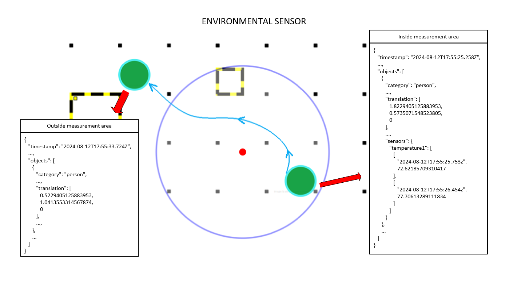
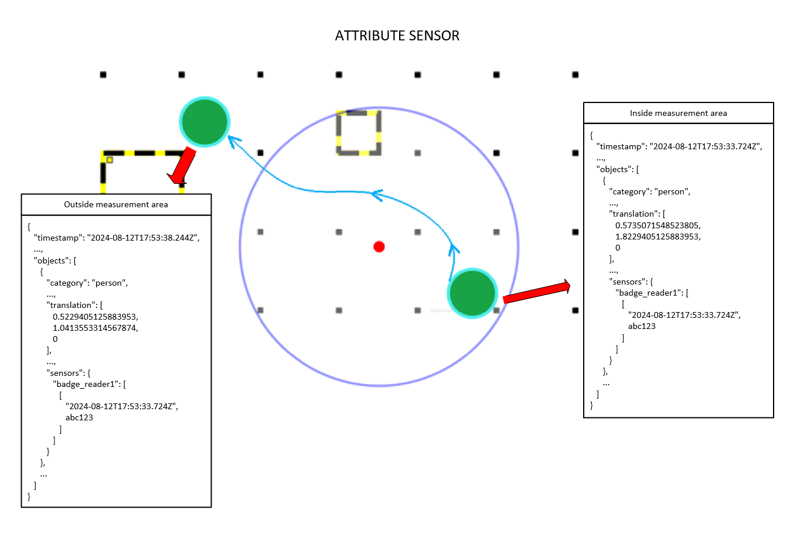

# Use Environmental and Attribute Sensor Types in Intel® SceneScape

This guide provides step-by-step instructions to integrate and use environmental and attribute sensor types in Intel® SceneScape. By completing this guide, you will:

- Understand the differences between environmental and attribute sensors.
- Learn how to configure and publish sensor data to Intel® SceneScape.
- Verify that sensor data is properly associated with tracked scene objects.

This task is important for enhancing your scene graph with real-world sensor data, enabling deeper insights from environmental context and object-specific attributes. If you're new to Scene Graphs or Intel® SceneScape, see [Integrating Cameras and Sensors](../integrate-cameras-and-sensors.md).

---

## Prerequisites

Before you begin, ensure the following:

- **Access and Permissions**: When using Intel® SceneScape secure broker for publishing sensor data, refer to [user access controls](https://github.com/open-edge-platform/scenescape/blob/release-2026.0/manager/config/user_access_config.json) and [access levels](https://github.com/open-edge-platform/scenescape/blob/release-2026.0/scene_common/src/scene_common/options.py).

If you're new to these concepts, see:

- [Intel® SceneScape README](https://github.com/open-edge-platform/scenescape/blob/release-2026.0/README.md)
- [MQTT Intro](https://mqtt.org/getting-started/)

---

## Steps to Integrate Environmental and Attribute Sensors

### 1. Understand Sensor Types

**Environmental Sensors** measure a property (e.g., temperature) for all objects within a defined measurement zone.
**Attribute Sensors** detect a property (e.g., badge ID) for a specific object and persist that value even after the object leaves the measurement area.

---

### 2. Configure and Use an Environmental Sensor

#### Create the Sensor

1. Log in to Intel® SceneScape.
2. Click on a scene.
3. Click on `Sensors` at the bottom of the scene.
4. Click `New Sensor` to create a sensor.
5. In the New Sensor form, fill out `Sensor ID`, `Name` and `Scene` fields.
6. Update the `Type of Sensor` to environmental.
7. Click `Add New Sensor` to save.

### Modify the Sensor

1. Click on `Sensors` at the bottom of the scene.
2. You will see the created sensor. Then click on the `manage` button.
3. In the Manage Sensor view, you can update attributes like Measurement area (Entire Scene, Circle or Custom region), Name, Sensor id, Scene, Singleton type, Color Range, etc. For more details on how to use the Color Range, refer to [Visualizing ROI and Sensor Areas](./visualize-regions.md).
4. Cick on `Save Sensor `to persist the modified sensor.

#### Publish Environmental Sensor Readings

From a third party application, publish sensor data to the topic `scenescape/data/sensor/<sensorName>`

> **Notes:**
>
> - Refer to [Singleton Sensor Data](../integrate-cameras-and-sensors.md#singleton-sensor-data) on what a sensor data looks and how to publish sensor data.

#### Verify the Results

Check the scene graph for objects within the sensor region:

**Expected Results**:

- All tracked objects within the region are tagged with the temperature value in their scene graph updates.

---

### 3. Configure and Use an Attribute Sensor

#### Step 1: Create the Sensor

1. Log in to Intel® SceneScape.
2. Click on a scene.
3. Click on `Sensors` at the bottom of the scene.
4. Click `New Sensor` to create a sensor.
5. In the New Sensor form, fill out `Sensor ID`, `Name` and `Scene` fields.
6. Update the `Type of Sensor` to attribute.
7. Click `Add New Sensor` to save.

Refer to [Modify the Sensor](#modify-the-sensor) on how to modify the attribute sensor.

#### Step 2: Publish Attribute Sensor Readings

From a third party application, publish sensor data to the topic `scenescape/data/sensor/<sensorName>`

> **Notes:**
>
> - Refer to [Singleton Sensor Data](../integrate-cameras-and-sensors.md#singleton-sensor-data) on what a sensor data looks and how to publish sensor data.

#### Step 3: Verify the Results

Check updates for the target object:

**Expected Results**:

- The object receives and retains the badge ID even after leaving the sensor zone.

---

## Supporting Resources

- [Visualize ROI and Sensor Areas](./visualize-regions.md)
- [Intel® SceneScape README](https://github.com/open-edge-platform/scenescape/blob/release-2026.0/README.md)
