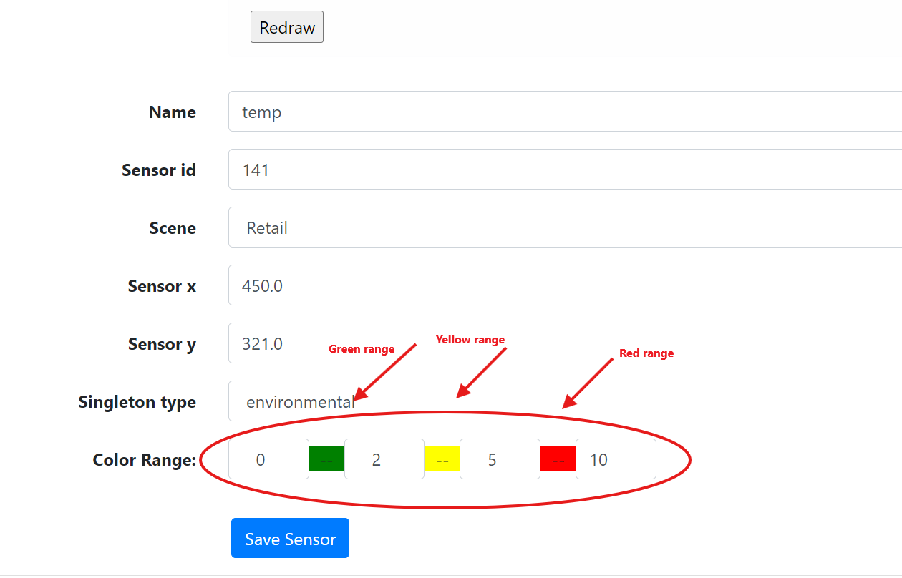
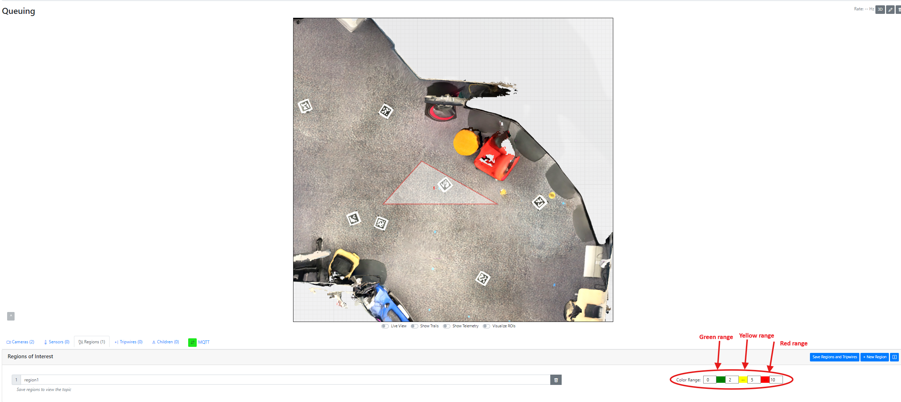
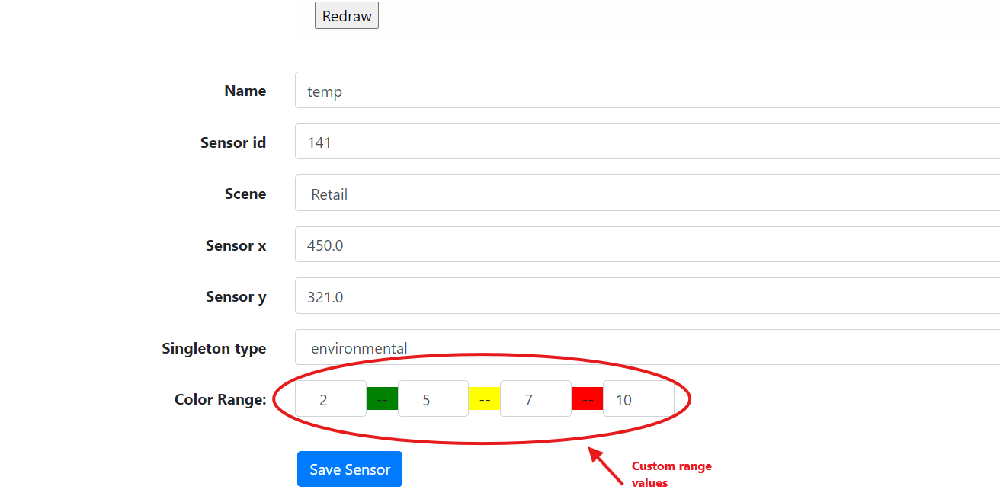
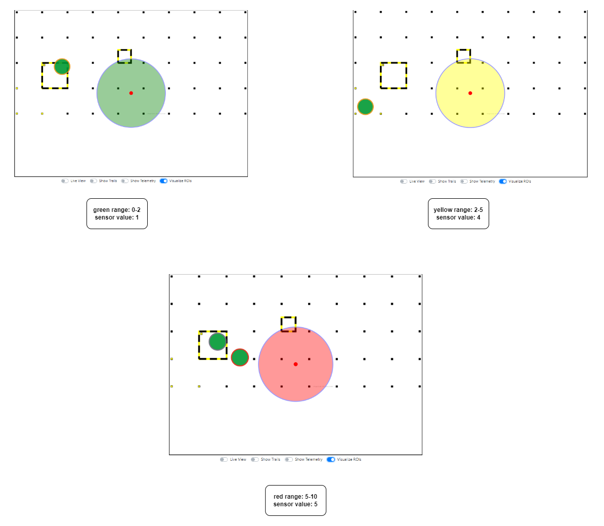
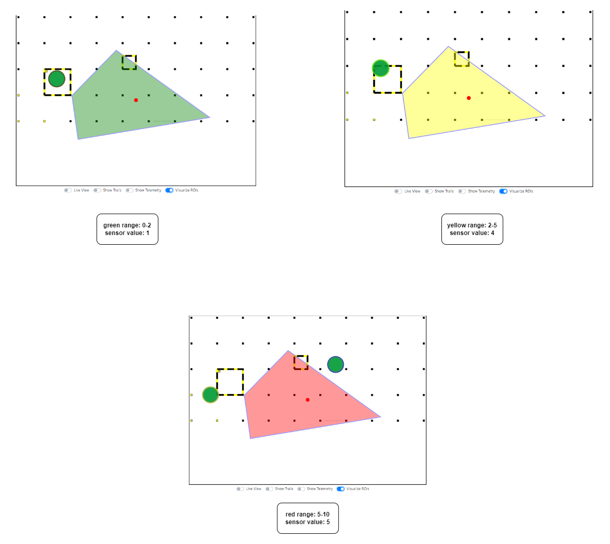

# Visualize ROI and Sensor Areas in Intel® SceneScape

This guide provides step-by-step instructions to visualize region of interest (ROI) and sensor areas using defined color thresholds in Intel® SceneScape. By completing this guide, you will:

- Set default and custom color range values for ROIs and sensors.
- Enable and view ROI and sensor visualization in the UI.
- Understand limitations regarding scene hierarchy transmission.

This task is important for visualizing scene activity and sensor measurements with intuitive color indicators. If you're new to ROI and sensor visualizations, refer to the Intel® SceneScape UI user documentation.

## Prerequisites

Before You Begin, ensure the following:

- **Dependencies Installed**: Install Intel® SceneScape and required tools.
- **Access and Permissions**: Ensure you have access to the Intel® SceneScape deployment and the UI.

This guide assumes familiarity with the Intel® SceneScape environment. If needed, see:

- [Intel® SceneScape README](https://github.com/open-edge-platform/scenescape/blob/release-2026.0/README.md)

## Steps to Visualize ROI and Sensor Areas

### 1. Set Color Range Values for Region of Interest (ROI)

When you create an ROI, default thresholds are automatically applied:

- **Green**: 0 to 2
- **Yellow**: 2 to 5
- **Red**: 5 to 10
  

To customize thresholds:

1. Navigate to the ROI settings.
2. Enter desired min-max values for each color category.
3. Click **Save Regions and Tripwires**.

**Expected Output**: The values update in the Intel® SceneScape UI and apply to visualizations.


**Figure 1**: Default color range values


**Figure 2**: Custom color range values

### 2. Visualize ROI Coloring

To view ROI coloring:

1. Toggle **Visualize ROIs** in the Intel® SceneScape UI.

**Expected Output**: ROI areas are shaded in green, yellow, or red based on the occupancy threshold.


**Figure 3**: ROI coloring effect

### 3. Set Color Range Values for Sensor Area

When you create a sensor area, default scalar thresholds are applied:

- **Green**: 0 to 2
- **Yellow**: 2 to 5
- **Red**: 5 to 10

To customize thresholds:

1. Open the sensor calibrate page.
2. Adjust the input values for each color.
3. Click **Save Sensor**.

**Expected Output**: Updated values are saved for the sensor and reflected in the visualization.


**Figure 5**: Default color range values for sensor area


**Figure 6**: Custom color range values for sensor area

### 4. Visualize Sensor Area Coloring

To enable visualization:

1. Toggle **Visualize ROIs** in the Intel® SceneScape UI.

**Expected Output**: Sensor measurement areas are colored based on thresholds. Supports different shapes:

- Circle
- Polygon


**Figure 7**: Circle sensor measurement visualization


**Figure 8**: Polygon sensor measurement visualization

> **Note**: ROI and sensor area visualizations do not propagate through the scene hierarchy. Visualization only reflects data for that specific scene.

## Configuration Options

### Customizable Parameters

| Parameter   | Purpose                                    | Expected Values      |
| ----------- | ------------------------------------------ | -------------------- |
| `min`/`max` | Defines threshold for color classification | Float/integer values |
| `color`     | Visual indicator for threshold range       | green, yellow, red   |

### Change Configurations

1. **Update Thresholds in UI**:

   Via the ROI or Sensor config panel:

   ```
   Green: min=0, max=2
   Yellow: min=2, max=5
   Red: min=5, max=10
   ```

2. **Apply Changes**:

   Click **Save Regions and Tripwires** or **Save Sensor** depending on the context.

## Supporting Resources

- [Intel® SceneScape README](https://github.com/open-edge-platform/scenescape/blob/release-2026.0/README.md)
