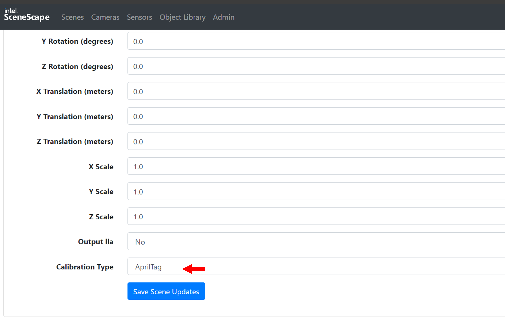
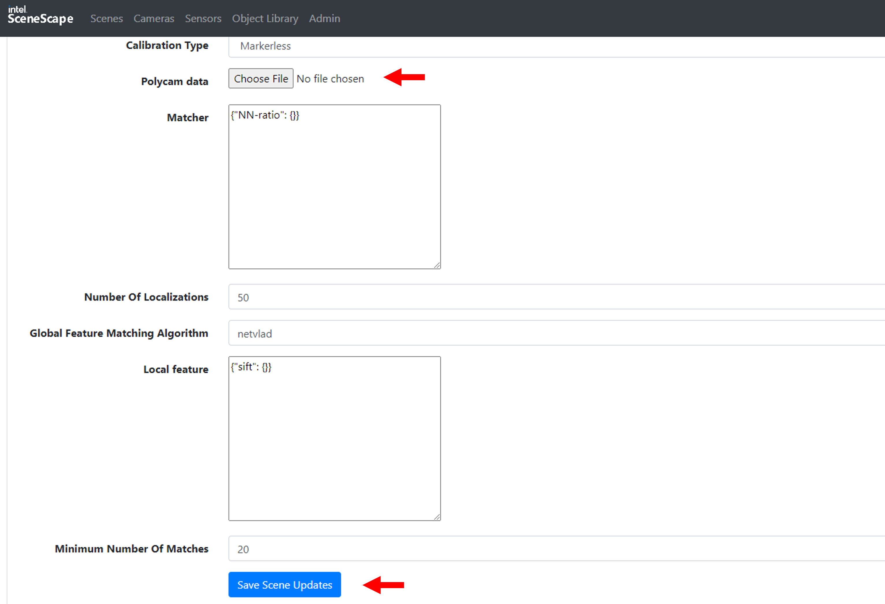
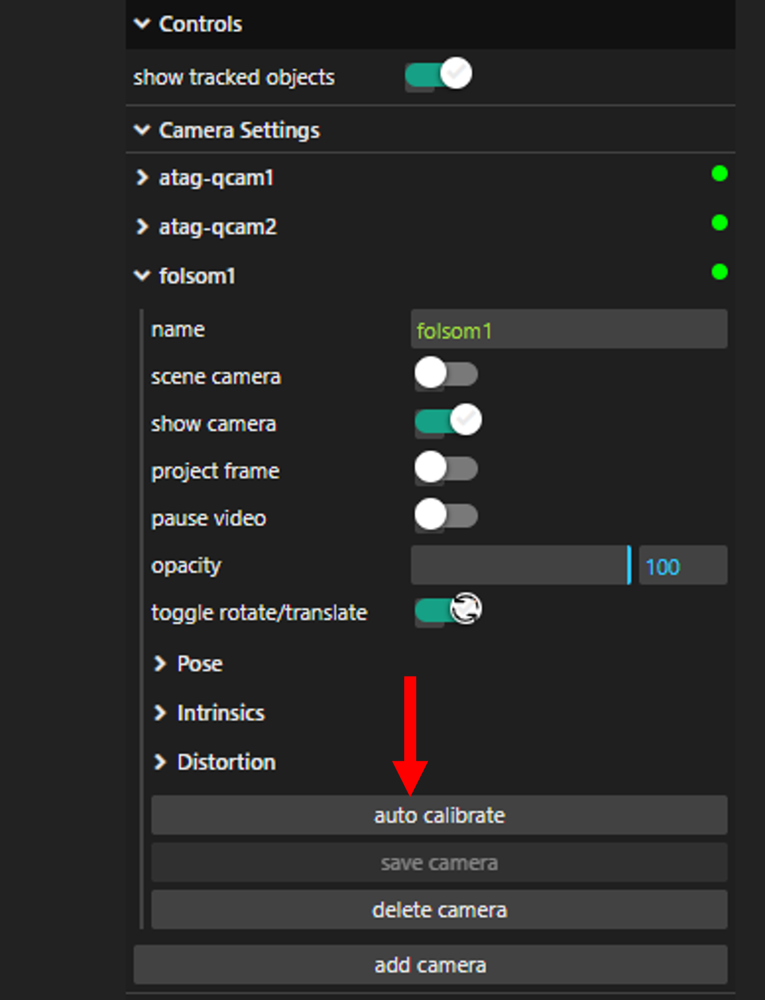
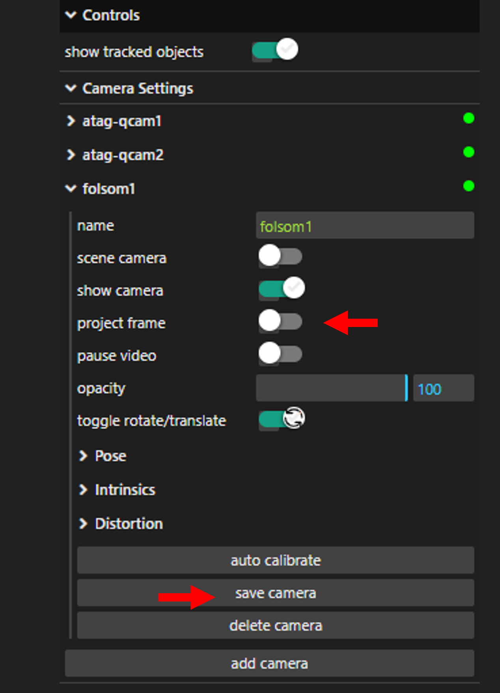

# Autocalibrate Cameras using Visual Features in Intel® SceneScape

This guide provides step-by-step instructions to calibrate cameras in Intel® SceneScape using markerless methods with raw RGBD data from Polycam. By completing this guide, you will:

- Capture and export valid Polycam datasets.
- Set up markerless camera calibration in Intel® SceneScape.
- Validate and adjust camera pose via 3D UI.

This task is essential for developers who want to simplify calibration by using RGBD scans rather than physical markers.

## Prerequisites

Before You Begin, ensure the following:

- **Device Requirements**: Use an iOS device with LiDAR (iPad Pro 2020+, iPhone 12 Pro+).
- **Polycam Requirements**: Use LiDAR or ROOM mode in [Polycam](https://apps.apple.com/us/app/polycam-3d-scanner-lidar-360/id1532482376).
- **Developer Mode**: Enable Developer Mode in the app settings to expose raw data export.
- **SceneScape Installation**: Installed and running on the host machine.

## Steps to Calibrate Using Markerless Camera Calibration

### 1. Generate Polycam Dataset

1. Open Polycam and switch to [LiDAR mode](https://learn.poly.cam/lidar-mode) or [ROOM mode](https://learn.poly.cam/room-mode).
2. Enable **Developer Mode** in settings to allow raw data export.
3. Capture a scan of the scene. After completion, export the dataset in **Raw** format.

The exported ZIP will contain:

- `raw.glb`
- `thumbnail.jpg`
- `polycam.mp4`
- `mesh_info.json`
- `keyframes/` (with images, cameras, depth, and confidence maps)

### 2. Configure Scene in Intel® SceneScape

1. Copy the Polycam ZIP dataset to the Intel® SceneScape host machine.
2. Open Intel® SceneScape and either:
   - Update an existing scene, or
   - Create a new scene using the `raw.glb` file in the _Map_ field.

3. On the Scene configuration page:
   - Set **Calibration Type** to `Markerless`
   - Upload the ZIP file in the **Polycam_data** field
   - Click **Save**

_Figure 1: Switch Calibration Type to Markerless._

_Figure 2: Upload the raw dataset ZIP from Polycam._

### 3. Perform Calibration in 3D UI

1. Add and configure cameras in the Scene.
2. Go to the 3D UI.
3. Select a camera, then click **Auto Calibrate**.
   - The camera pose will update upon completion.

_Figure 3: Click the Auto Calibrate button in the 3D UI._

4. Enable **Project Frame** to verify pose visually.
5. Adjust manually if needed, then click **Save Camera**.

_Figure 4: Visualize and save calibrated camera pose._

> **Note**: Markerless calibration does **not** work in the 2D UI.
>
> **Note**: Markerless calibration has only been tested with **pinhole camera models**. Use narrow-FOV cameras with minimal distortion. See [Camera Selection Considerations](../build-a-scene/create-new-scene.md#camera-selection-considerations) for supported camera types.

## Customizable Parameters

| Parameter        | Purpose                                                 | Expected Values/Range                 |
| ---------------- | ------------------------------------------------------- | ------------------------------------- |
| Calibration Type | Specifies the calibration method                        | `AprilTag`, `Markerless`              |
| Polycam_data     | Raw Polycam dataset ZIP used for markerless calibration | Valid Polycam ZIP file with RGBD data |
| Camera Model     | Defines the camera projection model                     | `Pinhole` (recommended)               |
| Intrinsics       | Camera lens parameters (fx, fy, cx, cy)                 | Positive floating-point numbers       |
| Project Frame    | Overlay camera view frustum on 3D scene                 | `Enabled`, `Disabled`                 |

## Future Enhancements

- Intel® SceneScape will support more dataset formats beyond Polycam.
- Dataset registration and calibration will be optimized for speed.

## Supporting Resources

- [Polycam Website](https://poly.cam)
- [Camera Selection Considerations](../build-a-scene/create-new-scene.md#camera-selection-considerations)
- [Use 3D UI for Calibration](./use-3D-UI-for-calibration.md)
