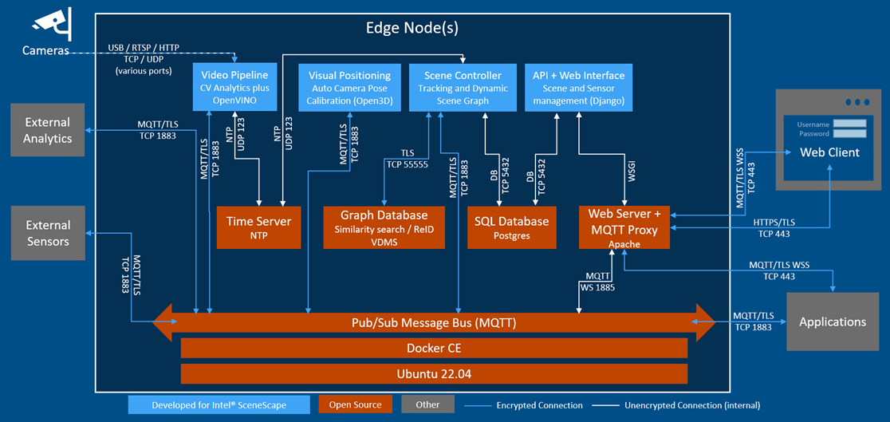

<!-- SPDX-FileCopyrightText: (C) 2025 Intel Corporation -->
<!-- SPDX-License-Identifier: Apache-2.0 -->

# Intel® SceneScape

<!--hide_directive

  <a class="icon_github" href="https://github.com/open-edge-platform/scenescape">
     GitHub project
  </a>
  <a class="icon_document" href="https://github.com/open-edge-platform/scenescape/blob/main/README.md">
     Readme
  </a>

hide_directive-->

Intel® SceneScape is a software framework that enables spatial awareness by integrating data from cameras and other sensors into scenes. It simplifies application development by providing near-real-time, actionable data about the state of the scene, including what, when, and where objects are present, along with their sensed attributes and environment. This scene-based approach makes it easy to incorporate and fuse sensor inputs, enabling analysis of past events, monitoring of current activities, and prediction of future outcomes from scene data.

Even with a single camera, transitioning to a scene paradigm offers significant advantages. Applications are written against the scene data directly, allowing for flexibility in modifying the sensor setup. You can move, modify, remove, or add cameras and sensors without changing your application or business logic. As you enhance your sensor array, the data quality improves, leading to better insights and decisions without altering your underlying application logic.

Intel® SceneScape turns raw sensor data into actionable insights by representing objects, people, and vehicles within a scene. Applications can access this information to make informed decisions, such as identifying safety hazards, detecting equipment issues, managing queues, correcting product placements, or responding to emergencies.

## How It Works

Intel® SceneScape uses advanced AI algorithms and hardware to process data from cameras and sensors, maintaining a dynamic scene graph that includes 3D spatial information and time-based changes. This enables developers to write applications that interact with a digital version of the environment in near real-time, allowing for responsive and adaptive application behavior based on the latest sensor data.

The framework leverages the Intel® Distribution of OpenVINO™ toolkit to efficiently handle sensor data, enabling developers to write applications that can be deployed across various Intel® hardware accelerators like CPUs, GPUs, VPUs, FPGAs, and GNAs. This ensures optimized performance and scalability.

A key goal of Intel® SceneScape is to make writing applications and business logic faster, simpler, and easier. By defining each scene with a fixed local coordinate system, spatial context is provided to sensor data. Scenes can represent various environments, such as buildings, ships, aircraft, or campuses, and can be linked to a global geographical coordinate system if needed. Intel® SceneScape manages:

- Multiple scenes, each with its own coordinate system.
- A single parent scene for each sensor at any given time.
- The precise location and orientation of cameras and sensors within the scene, stored in the Intel® SceneScape database. This information is crucial for interpreting sensor data correctly.
- Compatibility with glTF scene graph representations.

Intel® SceneScape is built on a collection of containerized services that work together to deliver comprehensive functionality, ensuring seamless integration and operation.

Figure 1: Architecture Diagram

### **Scene Controller**

Maintains the current state of the scene, including tracked objects, cameras, and sensors. For more information, refer to [Scene Controller Microservice](./microservices/controller/controller.md).

### **Deep Learning Streamer Pipeline Server**

Deep Learning Streamer Pipeline Server (DL Streamer Pipeline Server) is a Python-based, interoperable containerized microservice for easy development and deployment of video analytics pipelines. For more information, refer to [Deep Learning Streamer Pipeline Server](https://github.com/open-edge-platform/edge-ai-libraries/tree/main/microservices/dlstreamer-pipeline-server/docs/user-guide).

### **Auto Camera Calibration**

Computes camera parameters utilizing known priors and camera feed. For more information, refer to [Auto Camera Calibration](./microservices/auto-calibration/auto-calibration.md).

### **MQTT Broker**

Mosquitto MQTT broker which acts as the primary message bus connecting sensors, internal components, and applications, including the web interface.

### **Web Server**

Apache web server providing a Django-based web UI which allows users to view updates to the scene graph and manage scenes, cameras, sensors, and analytics. It also serves the Intel® SceneScape REST API.

### **NTP Server**

Time server which maintains the reference clock and keeps clients in sync.

### **SQL Database**

PostgreSQL database server which stores static information used by the web UI and the scene controller. No video or object location data is stored by Intel® SceneScape.

## Supporting Resources

- [Get Started](./get-started.md)
- [API Reference](./api-reference.md)
- [Camera normalization](./additional-resources/convert-object-detections-to-normalized-image-space.md)

<!--hide_directive
:::{toctree}
:hidden:

get-started
Using Intel® SceneScape <using-intel-scenescape/index.md>
Calibrating Cameras <calibrating-cameras/index.md>
Building a Scene <building-a-scene/index.md>
Other Topics <other-topics/index.md>
Additional Resources <additional-resources/index.md>
Microservices <./microservices/microservices.md>
api-reference
troubleshooting

:::
hide_directive-->
