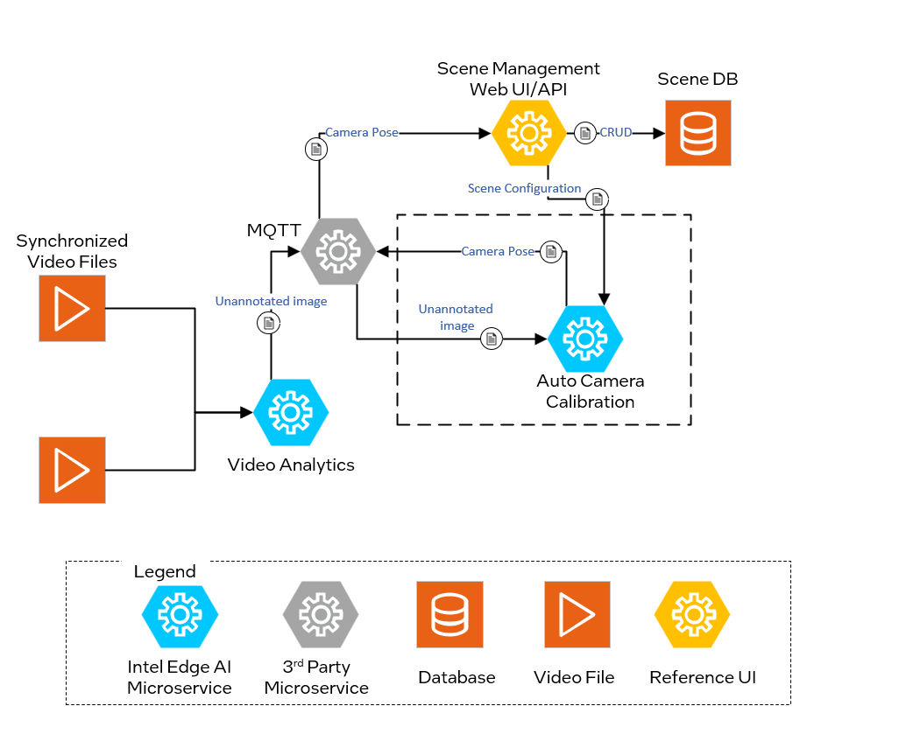
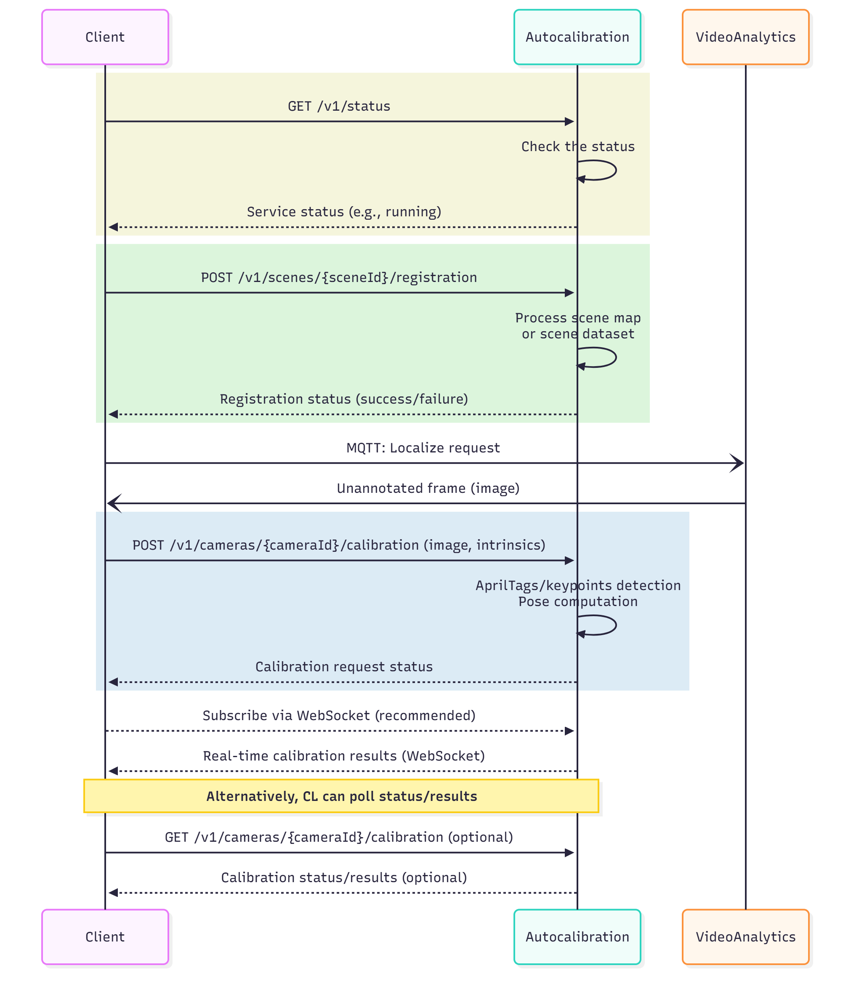

<!--hide_directive

  <a class="icon_github" href="https://github.com/open-edge-platform/scenescape/tree/main/autocalibration">
     GitHub project
  </a>
  <a class="icon_document" href="https://github.com/open-edge-platform/scenescape/blob/main/autocalibration/README.md">
     Readme
  </a>

hide_directive-->

# Auto Camera Calibration Service

Auto camera calibration service computes camera parameters automatically instead of
complicated manual calibration methods.

The calibration process begins with the client sending a heartbeat command to verify if the
calibration service is active. Upon receiving this, the service responds with its current
status, such as "running" or "alive." If the status confirms that the service is running, the
client issues a command to initiate camera localization. The calibration service then processes
this request and returns the resulting camera pose data.

The auto calibration services supports two types of camera calibration methods:

- **AprilTag Calibration**: This method uses fiducial markers called AprilTags placed within
  the scene. By detecting these markers in the camera's view, the service calculates the
  camera's position, enhancing calibration accuracy and efficiency. Check out the detailed guide
  on how to [Use AprilTag Camera Calibration](../../calibrating-cameras/how-to-autocalibrate-cameras-using-apriltags.md).

- **Markerless Calibration**: This approach leverages raw RGBD data from a [Polycam](https://poly.cam/) scan to estimate the camera's position in the scene, eliminating the need for physical markers. Check out the detailed guide on how to [Autocalibrate Cameras Using Visual Features](../../calibrating-cameras/how-to-autocalibrate-cameras-using-visual-features.md).

To deploy the auto calibration service, refer to the [Get Started](./get-started.md) guide. The service supports configuration through specific arguments and flags ([listed below](#configurable-arguments-and-flags)), which default to predefined values unless explicitly modified.

## Configurable Arguments and Flags

`--resturl`: Specifies the URL of the REST server used to provide scene configuration details through the REST API.

`--restauth`: Authentication credentials for the REST server. This can be provided as `user:password` or as a path to a JSON file containing the authentication details.

`--rootcert`: Path to the CA (Certificate Authority) certificate used for verifying the authenticity of the server's certificate.

`--cert`: Path to the client certificate file used for secure communication.

`--restport`: Defines the port number on which the REST API server is exposed. The default value is `8443`.

`--ssl-certfile`: Specifies the file path to the SSL certificate used for securing REST API communications. This argument is required.

`--ssl-keyfile`: Specifies the file path to the SSL private key corresponding to the certificate. This argument is required.

## Architecture

_Figure 1: Architecture Diagram_

### Sequence Diagram: Auto Camera Calibration Workflow

The workflow below illustrates the Auto Camera Calibration process. Camera pose is determined through two main steps: **scene registration** and **localization**.

1. **Scene Registration**:
   - The Client sends a GET request to the `/v1/status` endpoint to check the status of the Auto Camera Calibration Microservice.
   - Once the service confirms it is operational, the Client sends a POST request to `/v1/scenes/{sceneId}/registration` endpoint.
   - The Microservice processes the scene map for AprilTag-based calibration or the RGBD dataset for markerless calibration.
   - After processing, the service returns the register status back to the Client, confirming successful registration.

2. **Localization**:
   - The Client then sends a POST to `/v1/cameras/{cameraId}/calibration` with the camera image and optional camera intrinsics.
   - The Auto Camera Calibration Microservice processes the frame to detect AprilTags or keypoints, using the registered scene map to compute the camera pose.
   - The Client subscribes to real-time calibration results via WebSocket notifications (recommended approach).
   - Alternatively, the Client can poll the calibration status and results using GET on `/v1/cameras/{cameraId}/calibration` endpoint.

_Figure 2: Auto Calibration Sequence diagram_

## Supporting Resources

- [Get Started Guide](./get-started.md)
- [API Reference](./api-reference.md)

<!--hide_directive
:::{toctree}
:hidden:

get-started
api-reference

:::
hide_directive-->
