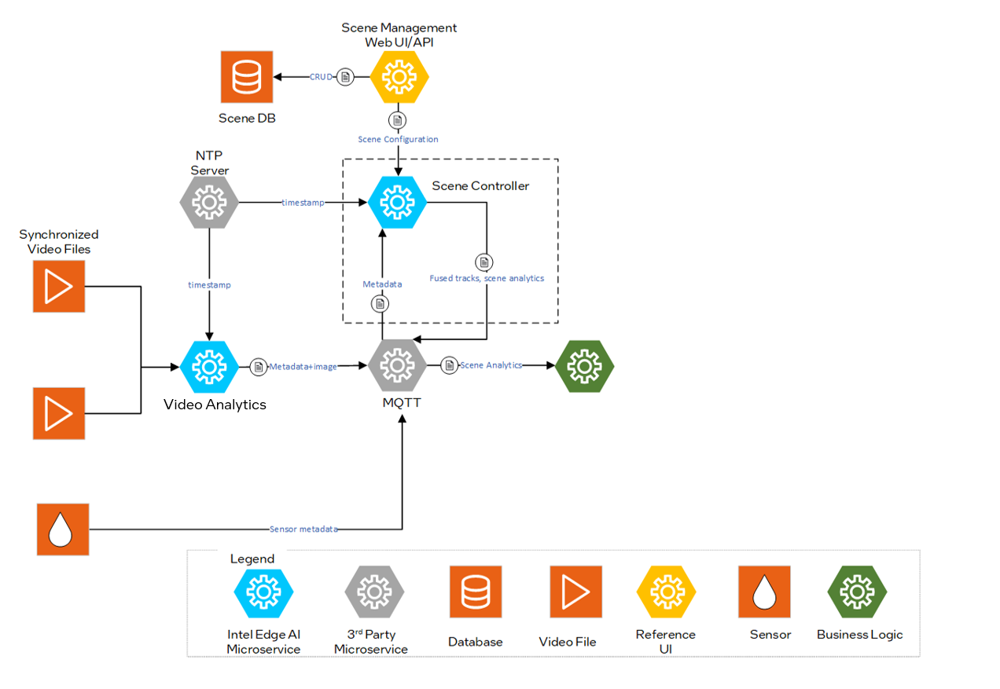
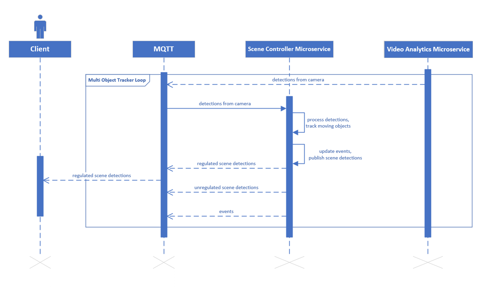

<!--hide_directive

  <a class="icon_github" href="https://github.com/open-edge-platform/scenescape/tree/main/controller">
     GitHub project
  </a>
  <a class="icon_document" href="https://github.com/open-edge-platform/scenescape/blob/main/controller/README.md">
     Readme

hide_directive-->

# Scene Controller Service

Scene Controller Microservice fuses multimodal sensor data to enable spatial analytics at the
edge for multiple use cases.

## Overview

The Scene Controller Microservice answers the fundamental question of `What, When and Where`. It receives object detections from multimodal inputs (primarily multiple cameras), contextualizes them in a common reference frame, fuses them and tracks objects over time.

The Scene Controller's output provides various insights for the tracked objects in a scene, including location, object visibility across cameras, velocity, rotation, center of mass. Additionally, base analytics like regions of interest, tripwires, and sensor regions are supported out of the box to enable developers to build their applications quickly and realize business goals.

To deploy the scene controller service, refer to the [Get Started](./get-started.md) guide. The service supports configuration through specific arguments and flags, which default to predefined values unless explicitly modified.

### Configurable Arguments and Flags

`--maxlag`: Maximum allowable delay for incoming messages. If a message arrives more than 1 second late, it will be discarded by the Scene Controller. This threshold can be adjusted to accommodate longer inference times, ensuring no messages are discarded. Discarded messages will appear as "FELL BEHINDS" in the service logs.

`--broker`: Hostname or IP of the MQTT broker, optionally with `:port`.

`--brokerauth`: Authentication credentials for the MQTT broker. This can be provided as `user:password` or as a path to a JSON file containing the authentication details.

`--resturl`: Specifies the URL of the REST server used to provide scene configuration details through the REST API.

`--restauth`: Authentication credentials for the REST server. This can be provided as `user:password` or as a path to a JSON file containing the authentication details.

`--rootcert`: Path to the CA (Certificate Authority) certificate used for verifying the authenticity of the server's certificate.

`--cert`: Path to the client certificate file used for secure communication.

`--ntp`: NTP server.

`--tracker_config_file`: Path to the JSON file containing the tracker configuration. This file is used to enable and manage time-based parameters for the tracker.

`--schema_file`: Specifies the path to the JSON file that contains the metadata schema. By default, it uses [metadata.schema.json](https://github.com/open-edge-platform/scenescape/blob/main/controller/src/schema/metadata.schema.json). This schema outlines the structure and format of the messages processed by the service.

`--visibility_topic`: Specifies the topic for publishing visibility information, which includes the visibility of objects in cameras. Options are `unregulated`, `regulated`, or `none`.

`--analytics-only`: Enables analytics-only mode (experimental feature). In this mode, the Scene Controller consumes tracked objects from a separate Tracker service via MQTT instead of performing tracking internally. The tracker is not initialized, and camera/scene data processing is skipped. Child scenes are not supported. This mode can also be enabled via the `CONTROLLER_ENABLE_ANALYTICS_ONLY` environment variable set to `true`.

### Tracker Configuration

For details see [How to Configure the Tracker](./how-to-configure-tracker.md).

## Architecture

Figure 1: Architecture Diagram

## Sequence Diagram: Scene Controller Workflow

The Client receives regulated scene detections via MQTT, which are the result of processing and filtering raw detections. The pipeline begins when the Scene Controller Microservice receives detections from the camera. It processes these to track moving objects, then publishes scene detections and events through MQTT. These messages may include both regulated (filtered and formatted) and unregulated (raw) scene detections. A Multi Object Tracker Loop is involved in managing detections within MQTT.

_Figure 2: Scene Controller Sequence diagram_

## Supporting Resources

- [Get Started Guide](./get-started.md)
- [How to Configure the Tracker](./how-to-configure-tracker.md)
- [API Reference](./api-reference.md)

<!--hide_directive
:::{toctree}
:hidden:

get-started.md
how-to-configure-tracker.md
api-reference.md

:::
hide_directive-->
