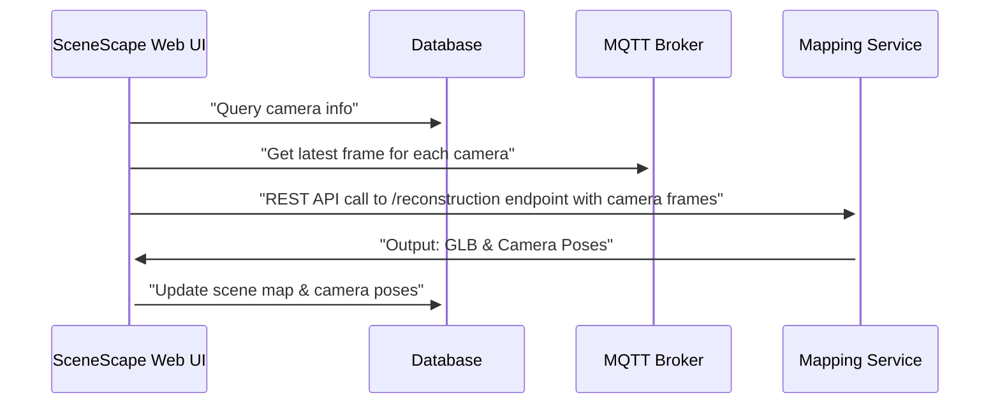

# Mapping Service

This Docker container provides a Flask REST API interface for 3D reconstruction with build-time
model selection, enabling generation of meshes and camera parameters from captured frames.
Each container is built with one of two state-of-the-art models:

- **MapAnything**: Universal Feed-Forward Metric 3D Reconstruction
- **VGGT**: Visual Geometry Grounded Transformer for sparse view reconstruction

## Features

- **Flask** based REST API with JSON responses
- **Build-Time Model Selection**: Single model per container, no dependency conflicts
- **Multi-image Input**: Process multiple images simultaneously
- **GLB Output**: Generate 3D models in GLB format
- **Camera Data**: Extract camera poses and intrinsics
- **Image Enhancement**: Automatic CLAHE preprocessing for improved contrast
- **Containerized**: Model-specific containers for clean deployment

## SceneScape Integration

The following diagram shows the dataflow between the Intel® SceneScape Web UI, database, MQTT
broker, and the Mapping Service.

> **Note:** The diagram is currently best viewed in light color mode.



## API Endpoints

### Health Check

```bash
GET /health
```

Returns service status and model availability.

### List Models

```bash
GET /models
```

Returns information about the model in this container and its status.

### 3D Reconstruction

```bash
POST /reconstruction
```

Perform 3D reconstruction from images and/or video.

#### Request Format

**Multipart Form Data (Required)**

The API accepts `Content-Type: multipart/form-data` to upload image and/or video files:

```bash
POST /reconstruction
Content-Type: multipart/form-data

Form fields:
- images: Image files (can specify multiple)
- video: Video file (optional)
- output_format: "glb" or "json" (default: "glb")
- mesh_type: "mesh" or "pointcloud" (default: "mesh")
- use_keyframes: "true" or "false" (for video, default: true)
```

**Notes:**

- You can provide images only, video only, or both together
- All inputs are processed as individual frames
- The API only accepts multipart/form-data format with actual file uploads
- JSON payloads with base64-encoded images are NOT supported
- `model_type` is no longer needed - the model is determined at build time

#### Response Format

```json
{
  "success": true,
  "model": "mapanything", // indicates which model was used
  "glb_data": "base64_encoded_glb_file",
  "camera_poses": [
    {
      "rotation": [0, 0, 0, 0], // quaternion rotation [x, y, z, w]
      "translation": [0, 0, 0] // 3D translation vector [x, y, z]
    }
  ],
  "intrinsics": [
    [
      [0, 0, 0],
      [0, 0, 0],
      [0, 0, 1]
    ] // 3x3 intrinsics matrix [[fx, 0, cx], [0, fy, cy], [0, 0, 1]]
  ],
  "processing_time": 15.23,
  "message": "Success message"
}
```

## Building and Running

Check out [How to Build from Source](./build-from-source.md) for instructions on building
the service from source and running it.

## Using the API

### Example with Python Client

```python
import base64
import requests

# Encode images to base64
def encode_image(image_path):
    with open(image_path, "rb") as f:
        return base64.b64encode(f.read()).decode('utf-8')

# Prepare request
payload = {
    "images": [
        {"data": encode_image("image1.jpg"), "filename": "image1.jpg"},
        {"data": encode_image("image2.jpg"), "filename": "image2.jpg"}
    ],
    "output_format": "glb"
}

# Send request
response = requests.post("https://localhost:8444/reconstruction", json=payload)
result = response.json()

if result["success"]:
    # Save GLB file
    glb_data = base64.b64decode(result["glb_data"])
    with open("output.glb", "wb") as f:
        f.write(glb_data)

    print(f"Model used: {result['model']}")
    print(f"Processing time: {result['processing_time']:.2f}s")
    print(f"Camera poses: {len(result['camera_poses'])}")
```

### Using the Included Client

```bash
# Check API health (model-agnostic)
python client_example.py --health-check --insecure

# Specify output type
python client_example.py --images image1.jpg image2.jpg --mesh-type mesh --output mesh.glb --insecure
python client_example.py --images image1.jpg image2.jpg --mesh-type pointcloud --output points.glb --insecure
```

### Using curl

```bash
# Health check
curl https://localhost:8444/health --insecure

# List models
curl https://localhost:8444/models --insecure

# Reconstruction with images (using multipart/form-data - recommended)
curl -X POST "https://localhost:8444/reconstruction" \
  -F "images=@image1.jpg" \
  -F "images=@image2.jpg" \
  -F "output_format=glb" \
  -F "mesh_type=mesh" \
  --insecure

# Reconstruction with video
curl -X POST "https://localhost:8444/reconstruction" \
  -F "video=@video.mp4" \
  -F "output_format=glb" \
  -F "mesh_type=mesh" \
  -F "use_keyframes=true" \
  --insecure

# Reconstruction with both images and video
curl -X POST "https://localhost:8444/reconstruction" \
  -F "images=@image1.jpg" \
  -F "images=@image2.jpg" \
  -F "video=@video.mp4" \
  -F "output_format=glb" \
  -F "mesh_type=mesh" \
  --insecure

# Save GLB output to file (requires jq for JSON parsing)
curl -X POST "https://localhost:8444/reconstruction" \
  -F "images=@image1.jpg" \
  -F "images=@image2.jpg" \
  -F "output_format=glb" \
  -F "mesh_type=mesh" \
  --insecure | jq -r '.glb_data' | base64 -d > output.glb
```

## Model Comparison

| Feature               | MapAnything           | VGGT                                                                     |
| --------------------- | --------------------- | ------------------------------------------------------------------------ |
| **License**           | Apache 2.0            | [VGGT License](https://github.com/3d-scene-recon/vggt/blob/main/LICENSE) |
| **Input**             | Multiple images       | Multiple images/video frames                                             |
| **Strength**          | Metric reconstruction | Sparse view reconstruction                                               |
| **Speed**             | Fast                  | Moderate                                                                 |
| **Memory**            | Lower                 | Higher                                                                   |
| **Quality**           | High for dense views  | High for sparse views                                                    |
| **Native Output**     | Watertight mesh       | Point cloud                                                              |
| **Supported Outputs** | Mesh, Point cloud     | Point cloud, Mesh                                                        |

## Development

### Adding Custom Models

To add support for additional models:

1. Create a new model class following the `ReconstructionModel` interface
2. Create a model-specific service file (e.g., `mymodel_service.py`)
3. Add model installation steps to the Dockerfile
4. Update the Makefile to support the new model type
5. Add build-time model selection logic

## Minimum Hardware Requirements

- **CPU**: 12th Gen or newer Intel® Core™ processors (i5 or higher), or 2nd Gen or newer Intel®
  Xeon® processors
- **RAM**:
  - MapAnything: 8GB minimum (4GB for model + overhead)
  - VGGT: 16GB minimum (8GB for model + overhead, more for high resolution images)
- **Storage**: 12GB free space for Docker images and models

## Performance Notes

- **First Run**: Initial model download may take several minutes
- **Memory Requirements**:
  - MapAnything: ~4GB RAM
  - VGGT: ~8GB RAM (more for high resolution)
- **Processing Time**: Varies by image count and resolution

## Best Practices

- **Image Preprocessing**: All input images automatically undergo Contrast Limited Adaptive
  Histogram Equalization (CLAHE) to enhance contrast and improve reconstruction quality,
  particularly for low-contrast or unevenly-lit scenes.
- **VGGT** pointcloud output scale is orders of magnitude smaller than the actual scene. The
  scale of the output mesh generated by **Map Anything** is closer to the actual scene than
  **VGGT**.
- The output mesh generated by **VGGT** version of the service has several issues currently.
  All of these issues will be addressed in the next Intel® SceneScape release:
  - It is not aligned with the original point cloud
  - The resolution of the texture is not sharp.
  - Pointcloud to mesh conversion takes many multiples of time taken by inference that
    generates the pointcloud.
- The service has not been tested with cameras which have distortion. Expect the reconstruction
  to perform poorly if your cameras show visual distortion.
- The reconstruction does not distinguish between static and dynamic objects. If the camera
  frames contain objects like persons, vehicles etc., the reconstruction will include those
  objects as well. For best results, call the service when the camera frames do not contain
  objects that should not be included in the mesh.

## Supporting Resources

- [Build from Source](./build-from-source.md): Build the service from source and run it.
- [API Reference](./api-docs/mapping-api.yaml): Comprehensive reference for the Mapping service
  REST API endpoints.

<!--hide_directive
:::{toctree}
:hidden:

./build-from-source.md

:::
hide_directive-->
