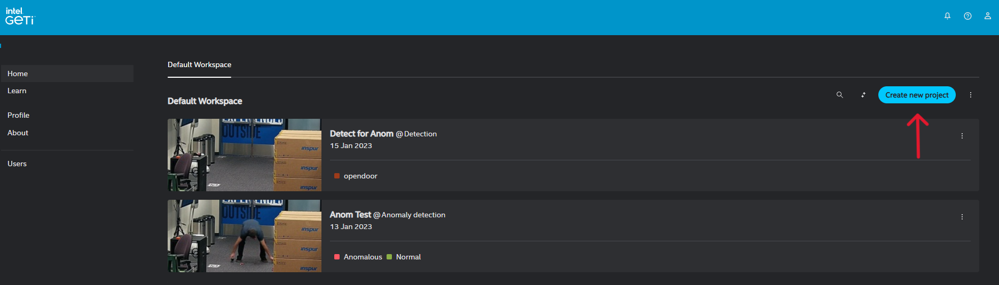
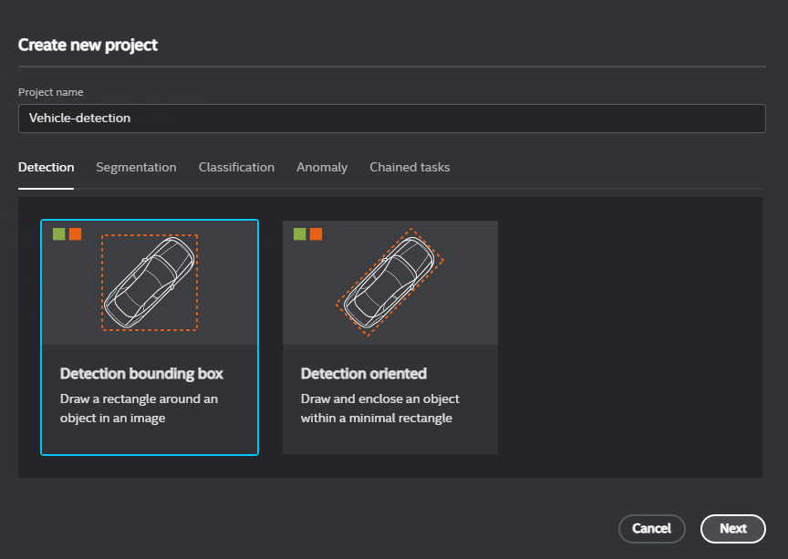
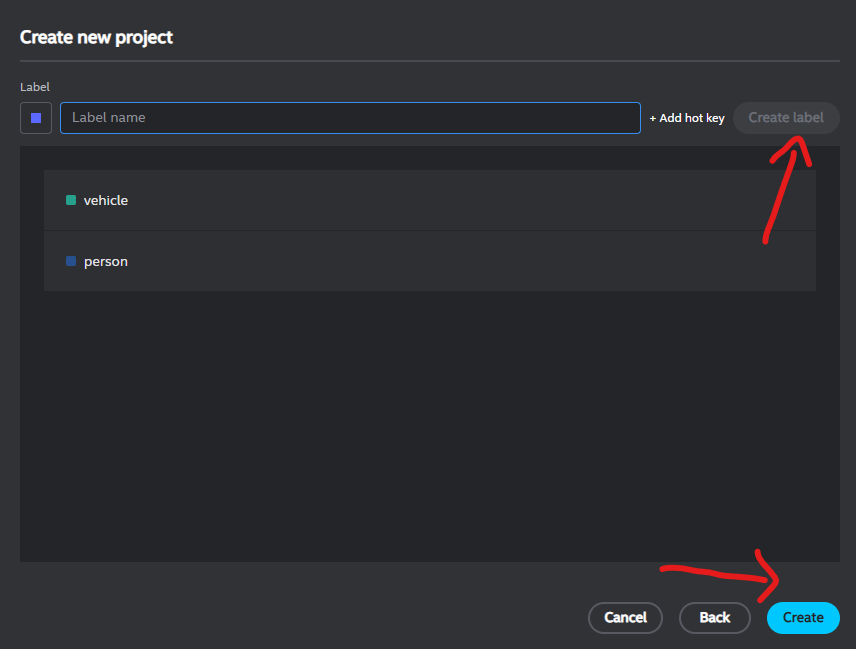
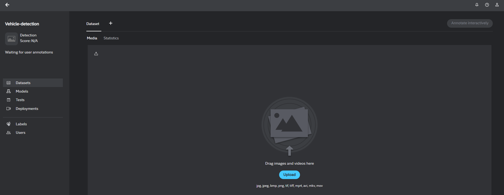
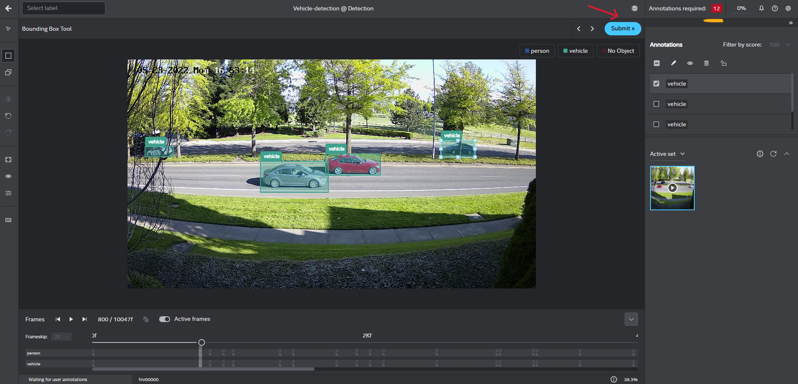
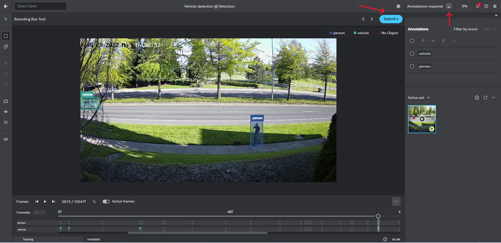
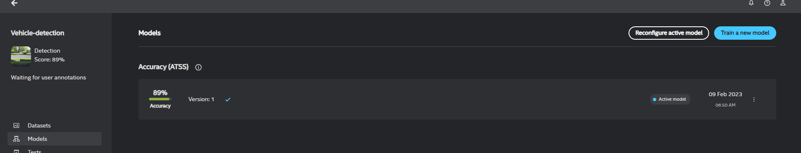
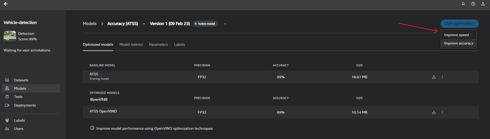
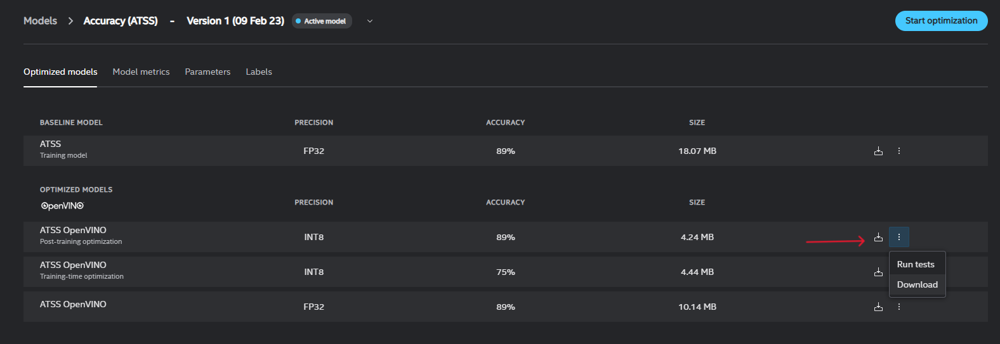
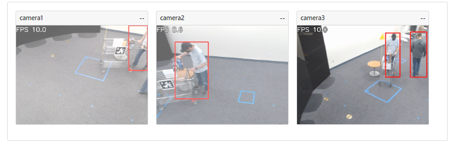

# How to Integrate Intel® Geti™ AI Models with Intel® SceneScape

This guide provides step-by-step instructions to train and integrate a custom AI model using the Intel® Geti™ platform with Intel® SceneScape. By completing this guide, you will:

- Train and export a custom AI model from Intel® Geti™.
- Integrate the model into the Intel® SceneScape pipeline.
- Validate inference results visually.

This task is important for deploying and validating custom vision models in production scenarios using Intel® SceneScape. If you’re new to Intel® Geti™, review [Intel® Geti™](https://www.intel.com/content/www/us/en/developer/tools/tiber/edge-platform/model-builder.html)

## Prerequisites

Before You Begin, ensure the following:

- **Dependencies Installed**: Docker, Docker Compose, and required Geti/SceneScape files.
- **Permissions**: Sufficient system access to configure files and run Docker containers.

This guide assumes familiarity with basic machine learning and Docker concepts. If needed, see:

- [Intel® Geti™ Platform Guide](https://docs.geti.intel.com/)
- [OpenVINO™ Toolkit Overview](https://docs.openvino.ai/2026/index.html)

## Steps to Integrate Geti AI Models

1. **Train and Export the Model in Intel® Geti™**:
   - **Login to your Geti instance**
     
   - **Create a project in Geti for your use case. Example: Vehicle-detection**
     
   - **Create labels**: Add a label for each type of object, by filling in the text box and clicking Create label. Example: vehicle, person
     
   - **Upload the data set file/folder**: Upload .mp4 video file for vehicle-detection model training
     
   - **Start interactive annotation on your data**: Annotation of a minimum of 12 frames is required for model training. The default frame skip is 25. Continue to draw bounding boxes and label the objects (vehicle, person) until you are satisfied with the results and then click `Submit >>`
     
   - **Start model training**: After annotating all the frames, click on `...` beside Annotation required to begin with model training.
     
   - **Your pre-trained model is ready**
     
   - **Optimize model**: Intel® Geti™ builds a baseline model and an OpenVINO™ optimized model. You can improve the model performance using OpenVINO™ optimization techniques.
     
   - **Download the trained model**: Each trained model is exported from Intel® Geti™ as a zip archive that includes a simple demo to visualize the results of model inference. We will only utilize a few files from this archive.
     

   **Expected Output**:
   - `model.xml`, `model.bin`, and `config.json` under `model/`.

   **Structure of generated zip**:
   - model
     - `model.xml`
     - `model.bin`
     - `config.json`
   - python
     - model_wrappers (Optional)
       - `__init__.py`
       - model_wrappers required to run demo
     - `README.md`
     - `LICENSE`
     - `demo.py`
     - `requirements.txt`

2. **Configuring DL Streamer Pipeline Server with new Geti Model**
   Follow documentation [here](https://github.com/open-edge-platform/edge-ai-libraries/blob/main/microservices/dlstreamer-pipeline-server/docs/user-guide/get-started.md) to use the newly trained Geti model with gvadetect and the [How to Configure DL Streamer Video Pipline](how-to-configure-dlstreamer-video-pipeline.md) to add custom models and configure the entire pipeline for enabling ingestion by Intel® SceneScape.

3. **Deploy Intel® SceneScape** (see [Docker Compose Profiles](../get-started.md#docker-compose-profiles) for details on choosing profiles):

   ```bash
   docker compose --profile controller down --remove-orphans
   docker compose --profile controller up -d
   ```

   Log into the Intel® SceneScape UI and verify that bounding boxes appear correctly.
   

## Supporting Resources

- [Intel® Geti™ Platform](https://geti.intel.com/platform)
- [OpenVINO™ Model Server Docs](https://docs.openvino.ai/2026/model-server/ovms_what_is_openvino_model_server.html)
