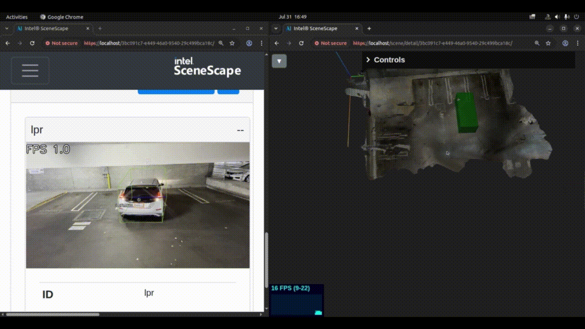

# How to run License Plate Recognition (LPR) with 3D Object Detection

This guide explains how to:

1. Set up and run the License Plate Recognition pipeline using DeepScenario model for 3D Object Detection.
2. Configure Intel® SceneScape to ingest the pipeline metadata and enable running spatial analytics on the Scene.

## Prerequisites

- Successful deployment of a Intel® SceneScape instance using [Get Started](../get-started.md)
- Access to the DeepScenario 3D Object Detection package

## Setup Steps

### 1. Prepare the Encoded Model

[Contact DeepScenario](https://www.deepscenario.com/#footer) for details to acquire the 3D object detection model deployment package. Copy the files following files from the DeepScenario deployment package into the dlstreamer-pipeline-server user_scripts directory:

```bash
# Navigate to the user_scripts directory
cd scenescape/dlstreamer-pipeline-server/user_scripts/

# Copy your model files
cp /path/to/your/model.enc .
cp /path/to/your/password.txt .
cp /path/to/your/categories.json .
cp /path/to/your/utils ./deepscenario_utils.py
```

### 2. Download Required Models

Download the required models for License Plate Detection and Optical Character Recognition to the following location `scenescape/model_installer/models/public/`. For more information, refer to [DL Streamer documentation](https://github.com/open-edge-platform/dlstreamer/tree/main/samples/gstreamer/gst_launch/license_plate_recognition#models).

### 3. Build the extended Docker container based on the DL Streamer Pipeline Server docker image

Running the `DeepScenario` script requires additional Python modules installed on top of the base DL Streamer Pipeline Server docker image.

Create a Dockerfile named `Dockerfile.dls-deepscenario` and copy the following into it:

```Dockerfile
FROM docker.io/intel/dlstreamer-pipeline-server:2025.2.0-extended-ubuntu24

USER root

RUN pip3 install scipy argon2-cffi cryptography opencv-python numpy openvino onnxruntime

RUN pip3 install torch torchvision torchaudio --index-url https://download.pytorch.org/whl/cpu

USER intelmicroserviceuser
```

And then build the image with:

```bash
docker build Dockerfile.dls-deepscenario -t dls-ps-deepscenario
```

### 4. Configure Video Analytics Pipeline

Create a file named `deepscenario-lpr-config.json` in `scenescape/dlstreamer-pipeline-server/` and copy the following content to the newly created file:

```
{
  "config": {
    "logging": {
      "C_LOG_LEVEL": "INFO",
      "PY_LOG_LEVEL": "DEBUG"
    },
    "pipelines": [
      {
        "name": "deepscenario-cam1",
        "source": "gstreamer",
        "pipeline": "multifilesrc loop=TRUE location=/home/pipeline-server/videos/input-video.ts name=source ! decodebin ! videoconvert ! video/x-raw,format=BGR ! gvapython class=PostDecodeTimestampCapture function=processFrame module=/home/pipeline-server/user_scripts/gvapython/sscape/sscape_adapter.py name=timesync ! gvapython class=DeepScenario module=/home/pipeline-server/user_scripts/DeepScenario.py function=process_frame name=deepscenario ! queue ! gvadeskew intrinsics-file=/home/pipeline-server/user_scripts/intrinsics.json ! queue ! gvadetect inference-region=1 model=/home/pipeline-server/models/yolov8_license_plate_detector/yolov8_license_plate_detector.xml ! queue ! gvaclassify model=/home/pipeline-server/models/ch_PP-OCRv4_rec_infer/ch_PP-OCRv4_rec_infer.xml ! gvametaconvert add-tensor-data=true name=metaconvert ! gvapython class=PostInferenceDataPublish function=processFrame module=/home/pipeline-server/user_scripts/gvapython/sscape/sscape_adapter.py name=datapublisher ! gvametapublish name=destination ! appsink sync=true",
        "auto_start": true,
        "parameters": {
          "type": "object",
          "properties": {
            "ntp_config": {
              "element": {
                "name": "timesync",
                "property": "kwarg",
                "format": "json"
              },
              "type": "object",
              "properties": {
                "ntpServer": {
                  "type": "string"
                }
              }
            },
            "deepscenario_config": {
              "element": {
                "name": "deepscenario",
                "property": "kwarg",
                "format": "json"
              },
              "type": "object",
              "properties": {
                "intrinsics_path": {
                  "type": "string",
                  "description": "Path to the camera intrinsics file."
                },
                "max_distance": {
                  "type": "number",
                  "description": "Maximum distance from camera for object detection. Objects beyond this threshold will be dropped."
                }
              }
            },
            "camera_config": {
              "element": {
                "name": "datapublisher",
                "property": "kwarg",
                "format": "json"
              },
              "type": "object",
              "properties": {
                "cameraid": {
                  "type": "string"
                },
                "metadatagenpolicy": {
                  "type": "string",
                  "description": "Meta data generation policy, one of detectionPolicy(default),reidPolicy,classificationPolicy"
                },
                "publish_frame": {
                  "type": "boolean",
                  "description": "Publish frame to mqtt"
                }
              }
            }
          }
        },
        "payload": {
          "destination": {
            "frame": {
              "type": "rtsp",
              "path": "lpr"
            }
          },
          "parameters": {
            "ntp_config": {
              "ntpServer": "ntpserv"
            },
            "deepscenario_config": {
              "intrinsics_path": "/home/pipeline-server/user_scripts/intrinsics.json",
              "max_distance": 28.0
            },
            "camera_config": {
              "cameraid": "lpr",
              "metadatagenpolicy": "ocrPolicy"
            }
          }
        }
      }
    ]
  }
}
```

#### Customizing the video analytics pipeline

The `deepscenario-config.json` file can be edited based on [DL Streamer Pipeline Server documentation](https://github.com/open-edge-platform/edge-ai-libraries/tree/main/microservices/dlstreamer-pipeline-server/docs/user-guide) to customize:

- Input sources (video files, USB, RTSP streams)
- Processing parameters
- Output destinations
- Model-specific settings
- Camera intrinsics

#### About the `max_distance` Parameter

The `max_distance` parameter in the DeepScenario model is used for depth-based filtering of objects detected in the frame. It acts as a threshold, ensuring that objects beyond the specified distance from the camera are not considered for detection. The value of `max_distance` can be adjusted in the `deepscenario_config` section of the pipeline configuration to suit specific use cases.

### 5. Configure Camera Intrinsics

The DeepScenario model requires accurate camera intrinsics to perform 3D object detection.

Create a file intrinsics.json in `scenescape/dlstreamer-pipeline-server/user_scripts` and configure it with actual values for fx, fy, cx, cy and k1 in the following format:

```
{
  "intrinsic_matrix": [
    [fx, 0.0, cx],
    [0.0, fy, cy],
    [0.0, 0.0, 1.0]
  ],
  "distortion_coefficients": [k1, 0.0, 0.0, 0.0, 0.0]
}
```

A good starting point for these values are camera vendor provided specs. However, if they are unavailable or are giving inaccurate results, refer to the [Use 2D UI for Manual Calibration](../how-to-guides/calibrate-cameras/use-2D-UI-for-calibration.md) guide for details on how to provide sufficient point correspondences for computing fx, fy and k1. cx and cy are always half the resolution of the frame in x and y.

Each pipeline can have a separate `intrinsics.json` file. The DeepScenario script accepts the path to the `intrinsics.json` file as `intrinsics_path` argument.

### 6. Modify Docker Compose Configuration

Edit the `sample_data/docker-compose-dl-streamer-example.yml` file to disable the `retail` and `queuing` video services and enable the `deepscenario` service:

**Remove the following sections:**

- `retail-video` service
- `queuing-video` service

**Add the `deepscenario` section:**

```yaml
deepscenario:
  image: dls-ps-deepscenario
  privileged: true
  networks:
    scenescape:
  tty: true
  entrypoint: ["./run.sh"]
  ports:
    - "8082:8080"
    - "8556:8554"
  devices:
    - "/dev/dri:/dev/dri"
  depends_on:
    broker:
      condition: service_started
    ntpserv:
      condition: service_started
  environment:
    - RUN_MODE=EVA
    - DETECTION_DEVICE=CPU
    - CLASSIFICATION_DEVICE=CPU
    - ENABLE_RTSP=true
    - RTSP_PORT=8554
    - REST_SERVER_PORT=8080
    - GENICAM=Balluff
    - GST_DEBUG=GST_TRACER:7
    - ADD_UTCTIME_TO_METADATA=true
    - APPEND_PIPELINE_NAME_TO_PUBLISHER_TOPIC=false
    - MQTT_HOST=broker.scenescape.intel.com
    - MQTT_PORT=1883
  volumes:
    - ./dlstreamer-pipeline-server/deepscenario-lpr-config.json:/home/pipeline-server/config.json
    - ./dlstreamer-pipeline-server/user_scripts:/home/pipeline-server/user_scripts
    - vol-dlstreamer-pipeline-server-pipeline-root:/var/cache/pipeline_root:uid=1999,gid=1999
    - ./sample_data:/home/pipeline-server/videos
    - ./model_installer/models/public/ch_PP-OCRv4_rec_infer/FP32:/home/pipeline-server/models/ch_PP-OCRv4_rec_infer
    - ./model_installer/models/public/yolov8_license_plate_detector/FP32:/home/pipeline-server/models/yolov8_license_plate_detector
  secrets:
    - source: root-cert
      target: certs/scenescape-ca.pem
```

Add `maxlag` option to the scene controller command:

```yaml
command: controller --broker broker.scenescape.intel.com --ntp ntpserv --maxlag 25
```

**Note**: The above video analytics pipeline is compute heavy due to the monocular 3D Object Detection and typically runs at 1.5-4 fps depending on HW configuration. As a result, the max tolerable lag needs to be set to a high value, to tolerate the lag from the arrival of frame for inferencing to when the metadata is received by controller. Without this change, all of the detections arriving at controller will be discarded with the console message "FELL BEHIND".

### 7. Required Files Structure

Ensure your directory structure looks like this:

```text
scenescape/
├── dlstreamer-pipeline-server/
│   ├── user_scripts/
│   │   ├── DeepScenario.py
│   │   ├── deepscenario_utils.py
│   │   ├── model.enc
│   │   ├── password.txt
│   │   ├── categories.json
│   │   └── intrinsics.json
│   └── deepscenario-lpr-config.json
├── model_installer/
│   └── models/
│       └── public/
│           ├── ch_PP-OCRv4_rec_infer/
│           │   └── FP32/
│           │       ├── ch_PP-OCRv4_rec_infer.xml
│           │       └── ch_PP-OCRv4_rec_infer.bin
│           └── yolov8_license_plate_detector/
│               └── FP32/
│                   ├── yolov8_license_plate_detector.xml
│                   └── yolov8_license_plate_detector.bin
└── sample_data/
    └── docker-compose-dl-streamer-example.yml
```

### 8. Build and Run

```bash
make

make demo
```

### 9. Verification

Check that the services are running correctly:

```bash
# Check service status
docker-compose ps
```

### 10. Adding a new scene and a new camera

- Create a new scene, add a camera with name and id set to `lpr` and calibrate the camera, by following [How to Create a New Scene](../how-to-guides/build-a-scene/create-new-scene.md#adding-the-new-scene-and-cameras).
- 3D Object Detection can occasionally lead to the object not being positioned on the ground plane. When there is a discrepancy from ground truth with respect to the `z` value in object `translation`, use the `Project to map` setting mentioned in the [How to Define Object Properties](./how-to-define-object-properties.md#additional-settings) guide.

### 11. Verifying the Setup

- Check the 3D UI of the newly created scene to verify that the pose and size of the object are as expected. The same output can also be verified by looking at MQTT output on the topic `/scenescape/data/scene/${scene_id}`. The object metadata will contain, the output of 3D object detection (translation, rotation, size etc.) and the license plate details.


Figure 1: 3D object detection

### Learn More

- Read [the solution brief](https://www.intel.com/content/www/us/en/content-details/824541/groundbreaking-4d-object-detection-with-deepscenario-and-intel-scenescape.html) to understand how the above setup can be used to detect parking violations with high accuracy.
- Pair [3D Object Detections with powerful spatial analytics](../how-to-guides/build-a-scene/configure-spatial-analytics.md).
