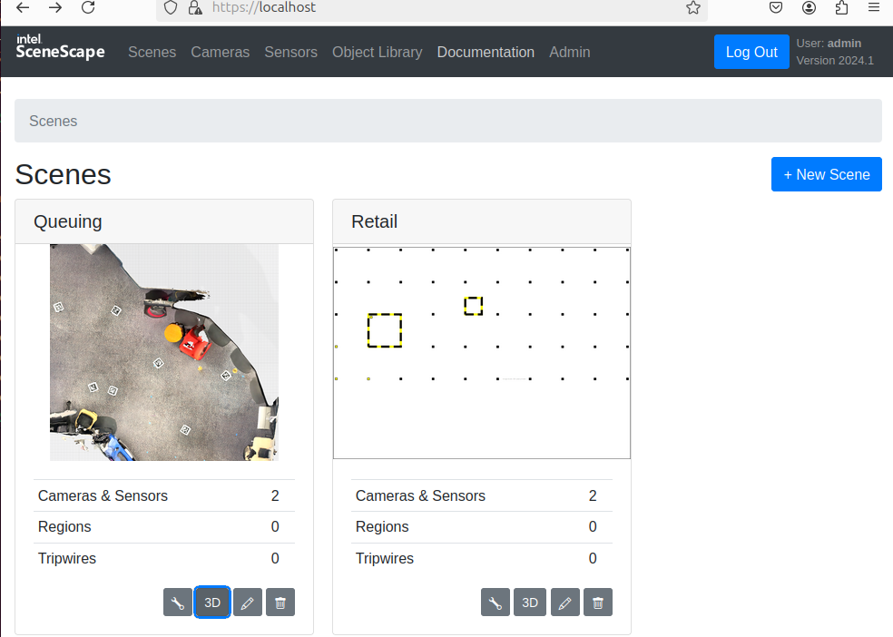
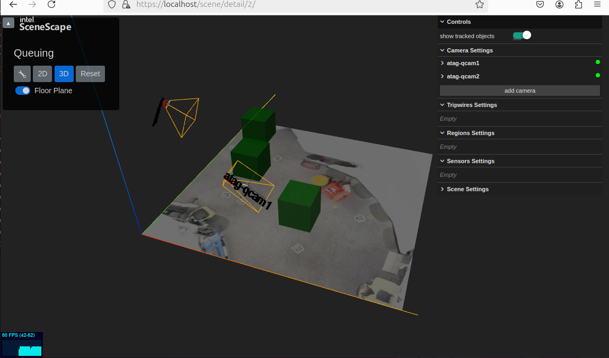
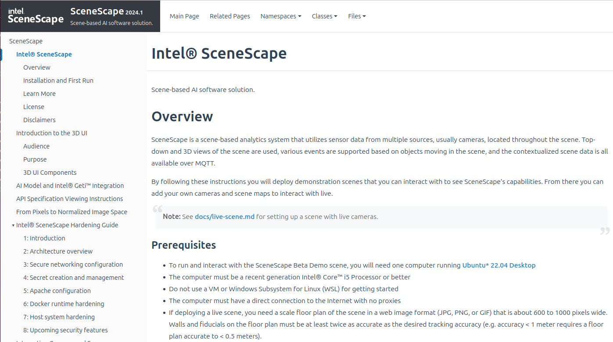
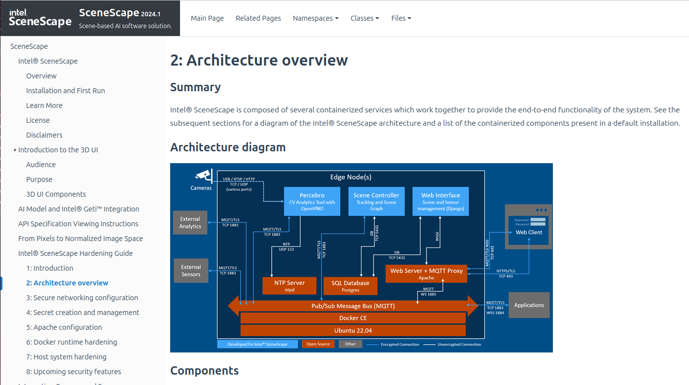

# Tutorial

These tutorials demonstrate how to use Intel® SceneScape user interface using a browser and access the online documentation.

- [Tutorial](#tutorial)
  - [Navigate Intel® SceneScape user interface](#navigate-scenescape-user-interface)
    - [Time to Complete](#time-to-complete-ui-walkthrough)
    - [Prerequisites](#prerequisites-for-exploring-user-interface)
    - [Explore User Interface](#explore-user-interface)
  - [Navigate Intel® SceneScape Documentation](#navigate-scenescape-online-documentation)
    - [Time to Complete](#time-to-complete-documentation-walkthrough)
    - [Prerequisites](#prerequisites-for-viewing-documentation)
    - [Explore Documentation](#explore-documentation)
  - [Summary](#summary)
  - [Learn More](#learn-more)

## Navigate Intel® SceneScape User Interface

By default, Intel® SceneScape provides two scenes that you can explore that are running from stored video data.

### Time To Complete UI Walkthrough

5-15 minutes

### Prerequisites For Exploring User Interface

Complete all steps in the [Get Started](../get-started.md) section.

### Explore User Interface

On local desktop, open browser and connect to https://localhost. If running remotely, connect using `"https://<ip_address>"` or `"https://<hostname>"`, using the correct IP address or hostname of the remote Intel® SceneScape system. Upon first connection a certificate warning is expected, click the prompts to continue to the site. For example, in Chrome click "Advanced" and then "Proceed to &lt;ip_address> (unsafe)".

> **Note:** These certificate warnings are expected due to the use of a self-signed certificate for initial deployment purposes. This certificate is generated at deploy time and is unique to the instance.

- Navigate through the scenes and view the system configuration. For example, clicking on the “3D” icon on the “Queueing” scene shows the 3D rendering of that scene with green boxes representing the detected position of people moving in the scene.
  
  Figure 1: Intel® SceneScape WebUI note the 3D button
  
  Figure 2: Intel® SceneScape 3D WebUI view

Using the mouse, one can rotate the 3D model and zoom in and out.

## Navigate Intel® SceneScape Online Documentation

Intel® SceneScape provides an html version of the documentation via the WebUI service.

### Time To Complete Documentation Walkthrough

5-15 minutes

### Prerequisites For Viewing Documentation

Complete all steps in the [Get Started](../get-started.md) section.

### Explore Documentation

On local desktop, open browser and connect to https://localhost. If running remotely, connect using `"https://<ip_address>"` or `"https://<hostname>"`, using the correct IP address or hostname of the remote Intel® SceneScape system. Upon first connection a certificate warning is expected, click the prompts to continue to the site. For example, in Chrome click "Advanced" and then "Proceed to &lt;ip_address> (unsafe)".

> **Note:** These certificate warnings are expected due to the use of a self-signed certificate for initial deployment purposes. This certificate is generated at deploy time and is unique to the instance.

- Click on the Documentation menu link at the top, explore the left side contents menu. For example, try selecting Learn More and using the links to
  additional information:
  
  Figure 3: Intel® SceneScape online documentation

- Or look at the Architectural overview in the Hardening Guide:
  
  Figure 4: Intel® SceneScape online documentation Architecture Overview

## Summary

In this tutorial, you learned how to navigate the Intel® SceneScape user interface from 2D to 3D view of the demo scenes via a browser and also view the documentation that comes with Intel® SceneScape.

## Learn More

- Understand the components, services, architecture, and data flow, in the [Overview](../index.md).
