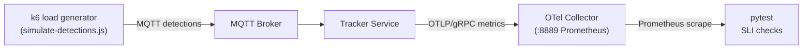

<!-- SPDX-License-Identifier: Apache-2.0 -->
<!-- Copyright (C) 2026 Intel Corporation -->

# Tracker Load Tests

Pytest-based load tests that validate the tracker service under sustained camera
load. The Makefile orchestrates the full lifecycle:

```
compose up (broker, otel-collector, tracker) → k6 run → pytest → compose down
```

## Quick Start

```bash
cd tracker/
make test-load                     # Default: 4 cameras × 15 fps × 300 objects, 1 min
```

Override defaults for boundary testing:

```bash
NUM_CAMERAS=8 FPS=30 NUM_OBJECTS=500 DURATION=5m make test-load
```

## Architecture



- **k6** ([simulate-detections.js](simulate-detections.js)) publishes MQTT
  detection messages simulating `NUM_CAMERAS` cameras at `FPS` frames/sec,
  each with `NUM_OBJECTS` bounding boxes.
- **Tracker** processes messages and exports metrics via OTLP/gRPC.
- **OTel Collector** ([config/otel-collector.yaml](config/otel-collector.yaml))
  receives OTLP and exposes a Prometheus scrape endpoint on port 8889.
- **pytest** scrapes Prometheus and validates SLIs.

## SLI Thresholds

| SLI              | Target         | Kind    | Metric                  | Description                        |
| ---------------- | -------------- | ------- | ----------------------- | ---------------------------------- |
| Dropped messages | < 0.1%         | Gate    | `tracker.mqtt.dropped`  | Ratio of dropped to total messages |
| Active tracks    | == NUM_OBJECTS | Gate    | `tracker.tracks.active` | Tracks match expected object count |
| Throughput       | ≥ input rate   | Warning | `tracker.mqtt.messages` | Sustained msg/s vs input rate      |
| Latency p50      | < 1/FPS s      | Warning | `tracker.mqtt.latency`  | Median end-to-end latency          |
| Latency p99      | < 2/FPS s      | Warning | `tracker.mqtt.latency`  | 99th percentile tail latency       |

**Gate** tests fail the build. **Warning** tests emit `pytest.warns()` but always pass.

### Latency Threshold Rationale

The tracker uses **time-chunking** (default 15 FPS = 66.7ms chunks) with a **2-chunk queue depth** per worker:

- **Chunk buffering**: Messages wait 0-67ms depending on arrival time within chunk (median ~33ms)
- **Processing time**: Parse, transform, track, publish (~10-50ms depending on object count)
- **Queue capacity**: 2 chunks maximum before drops

**p50 < 1 chunk period (67ms @ 15 FPS)**: Warning threshold indicating system is keeping pace. Typical p50 is 30-60ms (half-chunk buffer wait + processing). Exceeding 1 chunk suggests processing is slow but not yet causing drops.

**p99 < 2 chunk periods (133ms @ 15 FPS)**: Hard warning before systematic drops. With 2-chunk queue capacity, if p99 latency approaches 3 chunk periods (200ms), the queue saturates and `tracker.mqtt.dropped{reason="dropped_queue_full"}` increments. The 2-chunk threshold catches performance degradation before data loss occurs.

**Drops are determined by sustained median latency, not tail spikes**: Occasional p99 spikes beyond 2 chunks won't cause drops if p50 remains low—the queue absorbs transient slowness. Drops occur when median processing consistently exceeds chunk arrival rate (p50 > ~134ms).

## Terminal Summary

After all tests, a summary table is printed with hardware context, observed values, thresholds, and pass/warn/fail status. When per-stage latency metrics are available, a breakdown is also shown:

```
===================================================================================================== Load Test Summary ======================================================================================================

  Hardware: Intel(R) Core(TM) Ultra 9 285H (16 cores), 62.1 GB, kernel 6.17.0-14-generic
  Load:     4 cam × 15 FPS × 900 obj = 60 msg/s for 1m (60s)

  KPI                            Actual       Threshold  Result
  -------------------------------------------------------------
  Dropped messages              0.0000%       < 0.1000%    PASS
  Active tracks                     900          == 900    PASS
  Throughput                 59.5 msg/s   >= 57.0 msg/s      OK
  Latency p50                 106.82 ms       < 66.7 ms    WARN
  Latency p99                 181.19 ms      < 133.3 ms    WARN

  Messages: 3572 received, 0 dropped

  Stage Latency (informational):
    Stage                    p50 (ms)    p99 (ms)
    ----------------------------------------------
    Parse                        1.78        9.11
    Buffer                       0.50        0.99
    Queue wait                  41.89       74.30
    Transform                    8.77       48.40
    Track                       49.88       87.45
    Publish                      1.03       12.80
    ----------------------------------------------
    End-to-end                 106.82      181.19
```

The hardware section helps reproduce results across machines. The per-stage breakdown is informational only — no thresholds are enforced. Note how the 900-object load test shows WARN on latency (p50/p99 exceed thresholds) but PASS on drops—the queue absorbs transient slowness as long as median processing keeps pace.

## Configuration

All parameters are environment-variable driven:

| Variable          | Default                       | Description                         |
| ----------------- | ----------------------------- | ----------------------------------- |
| `NUM_CAMERAS`     | 4                             | Simulated camera count              |
| `FPS`             | 15                            | Frames per second per camera        |
| `NUM_OBJECTS`     | 300                           | Detections per message              |
| `DURATION`        | 1m                            | Nominal test duration (SLI window)  |
| `LATENCY_P50_MS`  | 1000/FPS                      | p50 warning: 1 chunk period (ms)    |
| `LATENCY_P99_MS`  | 2000/FPS                      | p99 warning: 2 chunk periods (ms)   |
| `THROUGHPUT_MIN`  | cameras × FPS × 0.95          | Minimum sustained msg/s             |
| `DROP_MAX_RATIO`  | 0.001                         | Maximum allowed drop ratio          |
| `PROMETHEUS_URL`  | http://localhost:8889/metrics | OTel Collector endpoint             |
| `METRICS_TIMEOUT` | 30                            | Seconds to wait for stable counters |

## Simulation Model

The k6 script ([simulate-detections.js](simulate-detections.js)) generates
synthetic MQTT detection messages that mimic real camera output.

### Object placement

Objects are placed on a **grid** across the camera's pixel space (1280×720).
The grid dimensions are derived from `NUM_OBJECTS`:

```
cols = ceil(sqrt(NUM_OBJECTS))
rows = ceil(NUM_OBJECTS / cols)
```

Each object occupies a unique cell with a small seeded-random jitter (±5 px),
guaranteeing a minimum pixel separation between any two objects. Deterministic
seeding (`SeededRandom(personId)`) ensures reproducible layouts across runs.

### World-space separation

The scene cameras in [config/scenes.json](config/scenes.json) are positioned at
50 m height with `fx = fy = 905` and resolution 1280×720. At that height each
pixel maps to ≈ 5.5 cm on the ground plane, giving a visible area of roughly
70 m × 40 m. With the grid layout the minimum object separation is well above
the tracker's 2.0 m matching threshold (`kTrackingDistanceThreshold` in
`tracking_worker.cpp`), so each detection produces exactly one track regardless
of object count.

### Movement

Each object moves linearly within its grid cell—start and end positions are
computed from the cell center with a bounded random offset. This creates
realistic per-frame position changes without any two objects crossing into each
other's matching radius. When an object reaches its endpoint it resets to a new
path within the same cell.

### Cross-camera deduplication

All four cameras share **identical extrinsics**: the same pixel coordinates
project to the same world point. The tracker's batched Hungarian matcher
correctly merges the four cameras' views of each object into a single track
(distance ≈ 0 between cameras). This validates the multi-camera deduplication
path under load.

## Files

| File                                                     | Purpose                               |
| -------------------------------------------------------- | ------------------------------------- |
| [test_load.py](test_load.py)                             | SLI test cases                        |
| [conftest.py](conftest.py)                               | Fixtures, Prometheus scraper, summary |
| [simulate-detections.js](simulate-detections.js)         | k6 MQTT load generator                |
| [compose.yml](compose.yml)                               | Docker Compose stack                  |
| [config/scenes.json](config/scenes.json)                 | Scene & camera configuration          |
| [config/otel-collector.yaml](config/otel-collector.yaml) | Collector config                      |
| [Dockerfile.k6](Dockerfile.k6)                           | k6 image with MQTT extension          |
